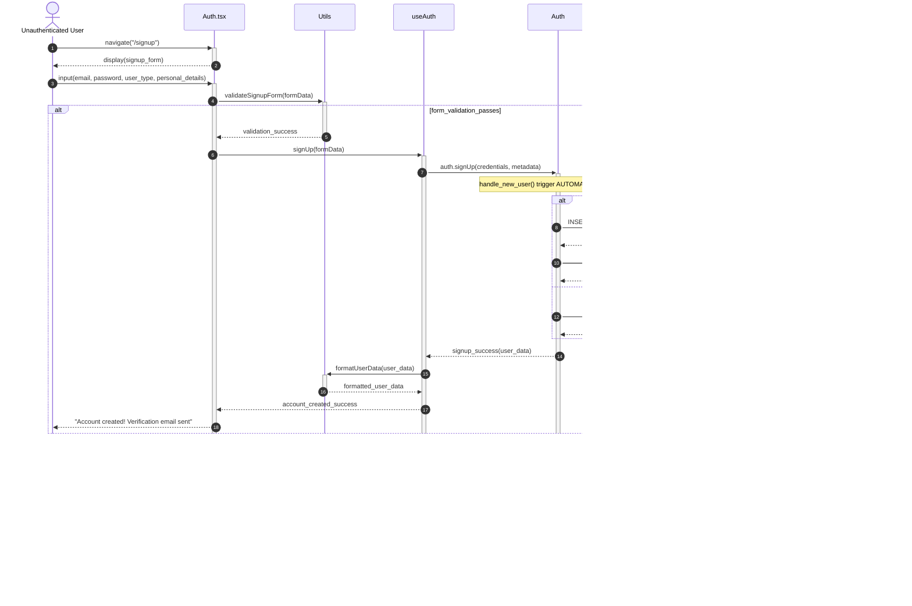
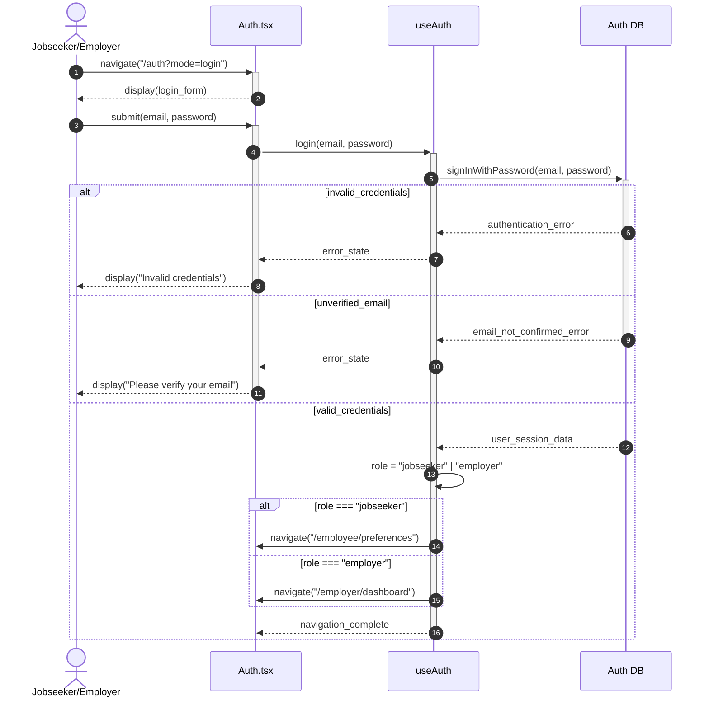
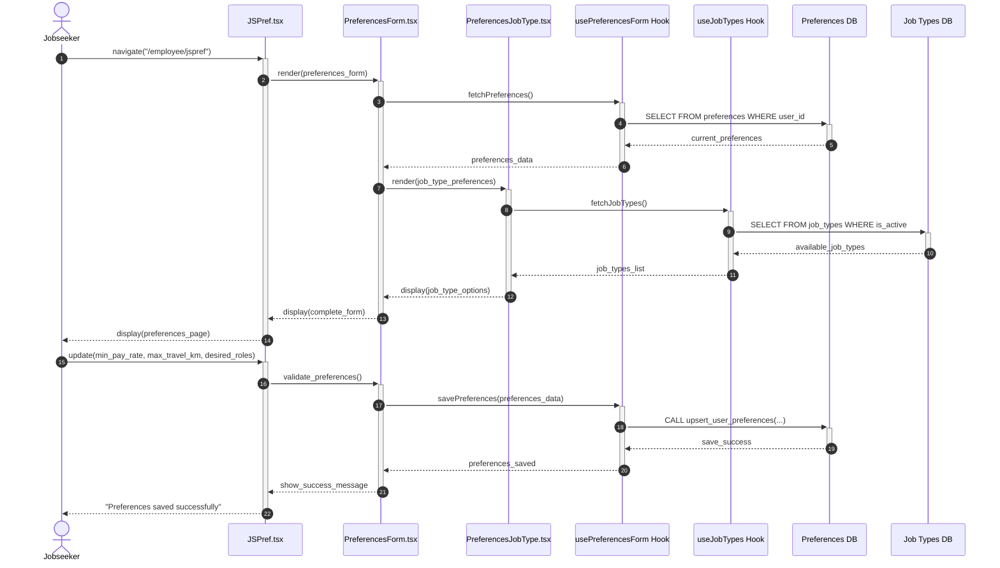
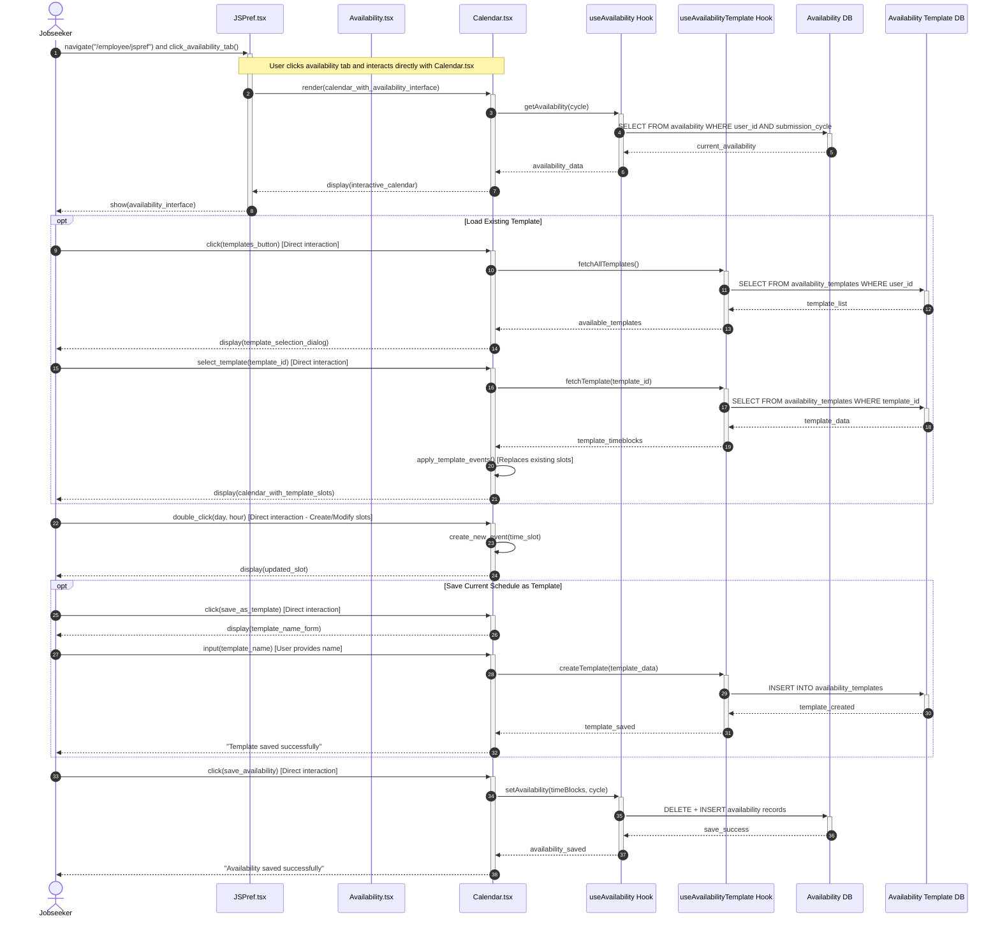
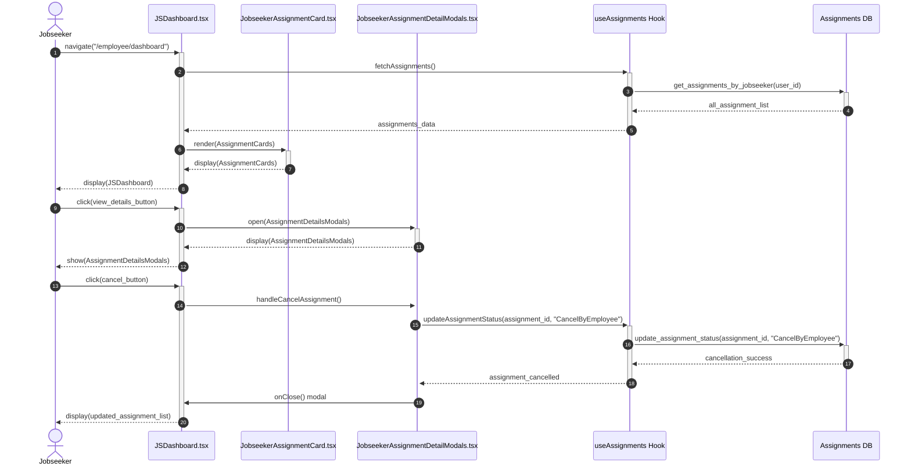
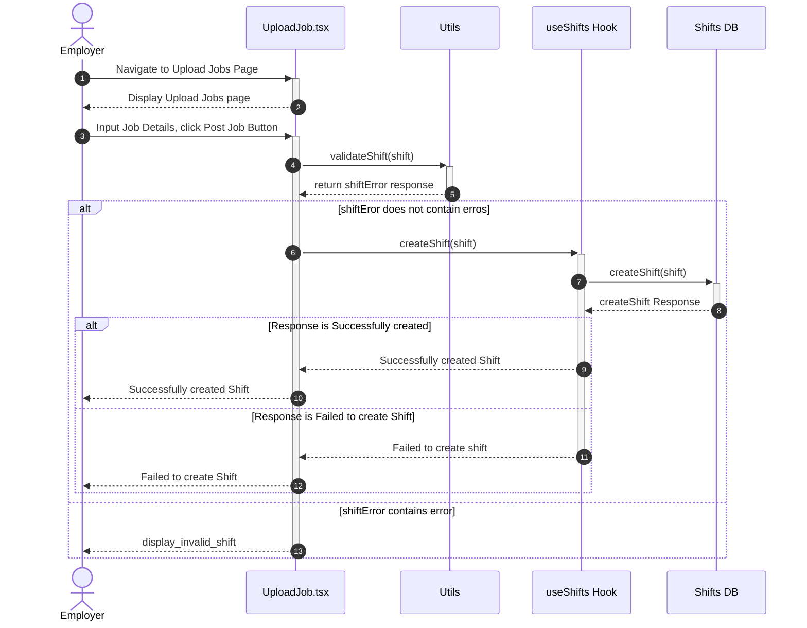
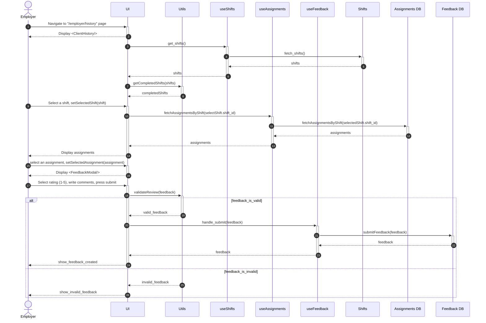
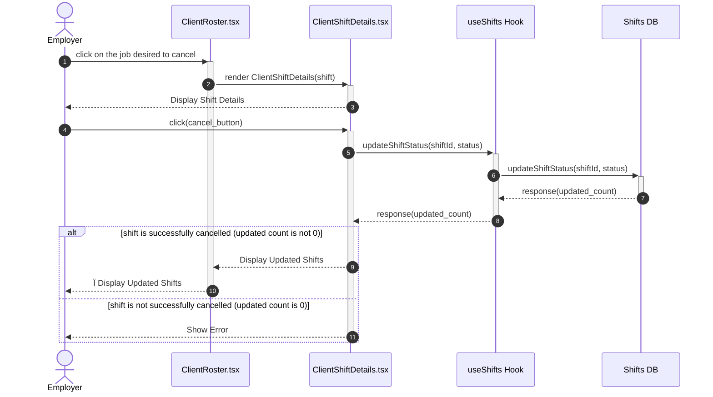

# UC1 

```mermaid
sequenceDiagram
    actor User as Unauthenticated User
    participant View as Auth.tsx
    participant Utils as Utils
    participant Controller as useAuth
    participant AuthUsers as Auth
    participant JobSeekers as Job Seekers DB
    participant Clients as Clients DB
    participant Preferences as Preferences DB

    autonumber
    %% User navigates to signup
    User->>+View: navigate("/signup")
    View-->>-User: display(signup_form)

    %% User fills form and submits
    User->>+View: input(email, password, user_type, personal_details)
    View->>+Utils: validateSignupForm(formData)

    alt form_validation_passes
        Utils-->>-View: validation_success
        View->>+Controller: signUp(formData)

        %% Authentication with Supabase
        Controller->>+AuthUsers: auth.signUp(credentials, metadata)
        
        %% Database trigger automatically fired
        Note over AuthUsers: handle_new_user() trigger AUTOMATICALLY executed
        
        %% Profile creation based on user type (via trigger)
        alt user_type === "job-seeker"
            AuthUsers->>+JobSeekers: INSERT INTO job_seekers (via trigger)
            JobSeekers-->>-AuthUsers: job_seeker_created
            AuthUsers->>+Preferences: INSERT INTO preferences (via trigger)
            Preferences-->>-AuthUsers: default_preferences_created
        else user_type === "employer"
            AuthUsers->>+Clients: INSERT INTO clients (via trigger)
            Clients-->>-AuthUsers: client_created
        end

        AuthUsers-->>Controller: signup_success(user_data)
        Controller->>+Utils: formatUserData(user_data)
        Utils-->>-Controller: formatted_user_data
        Controller-->>View: account_created_success
        View-->>User: "Account created! Verification email sent"

    else form_validation_fails
        Utils-->>View: validation_errors
        View-->>User: display(error_messages)
    end

    %% Error handling for existing email
    alt email_already_exists
        AuthUsers-->>-Controller: signup_error("Email already registered")
        Controller-->>-View: show_existing_email_error
        View-->>-User: "Email already registered. Try signing in instead."
    end
```

# UC2 

```mermaid
sequenceDiagram
autonumber
    actor User as Jobseeker/Employer
    participant View as Auth.tsx
    participant Controller as useAuth

    participant Supabase as Auth DB

    User->>+View: navigate("/auth?mode=login")
    View-->>-User: display(login_form)

    User->>+View: submit(email, password)

    View->>+Controller: login(email, password)

    Controller->>+Supabase: signInWithPassword(email, password)

    alt invalid_credentials
        Supabase-->>Controller: authentication_error
        Controller-->>View: error_state
        View-->>User: display("Invalid credentials")

    else unverified_email
        Supabase-->>-Controller: email_not_confirmed_error
        Controller-->>View: error_state
        View-->>-User: display("Please verify your email")

    else valid_credentials

        Supabase-->>Controller: user_session_data


        %% Role determination logic (normal case for registered users)
        Controller->>Controller: role = "jobseeker" | "employer"


        alt role === "jobseeker"
            Controller->>View: navigate("/employee/preferences")
        else role === "employer"
            Controller->>View: navigate("/employer/dashboard")
        end

        Controller-->>-View: navigation_complete
    end

```

# UC3

```mermaid
sequenceDiagram
autonumber
    actor Jobseeker as Jobseeker
    participant JSPref as JSPref.tsx
    participant PreferencesForm as PreferencesForm.tsx
    participant PreferencesJobType as PreferencesJobType.tsx
    participant usePreferencesForm as usePreferencesForm Hook
    participant useJobTypes as useJobTypes Hook
    participant PreferencesDB as Preferences DB
    participant JobTypesDB as Job Types DB

    %% Navigate to preferences
    Jobseeker->>+JSPref: navigate("/employee/jspref")
    JSPref->>+PreferencesForm: render(preferences_form)
    PreferencesForm->>+usePreferencesForm: fetchPreferences()
    usePreferencesForm->>+PreferencesDB: SELECT FROM preferences WHERE user_id
    PreferencesDB-->>-usePreferencesForm: current_preferences
    usePreferencesForm-->>-PreferencesForm: preferences_data
    
    PreferencesForm->>+PreferencesJobType: render(job_type_preferences)
    PreferencesJobType->>+useJobTypes: fetchJobTypes()
    useJobTypes->>+JobTypesDB: SELECT FROM job_types WHERE is_active
    JobTypesDB-->>-useJobTypes: available_job_types
    useJobTypes-->>-PreferencesJobType: job_types_list
    
    PreferencesJobType-->>-PreferencesForm: display(job_type_options)
    PreferencesForm-->>-JSPref: display(complete_form)
    JSPref-->>-Jobseeker: display(preferences_page)

    %% User updates preferences
    Jobseeker->>+JSPref: update(min_pay_rate, max_travel_km, desired_roles)
    JSPref->>+PreferencesForm: validate_preferences()
    PreferencesForm->>+usePreferencesForm: savePreferences(preferences_data)
    usePreferencesForm->>+PreferencesDB: CALL upsert_user_preferences(...)
    PreferencesDB-->>-usePreferencesForm: save_success
    usePreferencesForm-->>-PreferencesForm: preferences_saved
    PreferencesForm-->>-JSPref: show_success_message
    JSPref-->>-Jobseeker: "Preferences saved successfully"
```

# UC4

```mermaid
sequenceDiagram
autonumber
    actor Jobseeker as Jobseeker
    participant JSPref as JSPref.tsx
    participant Availability as Availability.tsx
    participant Calendar as Calendar.tsx
    participant useAvailability as useAvailability Hook
    participant useAvailabilityTemplate as useAvailabilityTemplate Hook
    participant AvailabilityDB as Availability DB
    participant TemplateDB as Availability Template DB

    %% Navigate to availability and load calendar
    Jobseeker->>+JSPref: navigate("/employee/jspref") and click_availability_tab()
    Note over JSPref,Calendar: User clicks availability tab and interacts directly with Calendar.tsx
    JSPref->>+Calendar: render(calendar_with_availability_interface)
    Calendar->>+useAvailability: getAvailability(cycle)
    useAvailability->>+AvailabilityDB: SELECT FROM availability WHERE user_id AND submission_cycle
    AvailabilityDB-->>-useAvailability: current_availability
    useAvailability-->>-Calendar: availability_data
    Calendar-->>-JSPref: display(interactive_calendar)
    JSPref-->>-Jobseeker: show(availability_interface)

    %% Optional: Load existing template first (replaces any existing slots)
    opt Load Existing Template
        Jobseeker->>+Calendar: click(templates_button) [Direct interaction]
        Calendar->>+useAvailabilityTemplate: fetchAllTemplates()
        useAvailabilityTemplate->>+TemplateDB: SELECT FROM availability_templates WHERE user_id
        TemplateDB-->>-useAvailabilityTemplate: template_list
        useAvailabilityTemplate-->>-Calendar: available_templates
        Calendar-->>-Jobseeker: display(template_selection_dialog)
        
        Jobseeker->>+Calendar: select_template(template_id) [Direct interaction]
        Calendar->>+useAvailabilityTemplate: fetchTemplate(template_id)
        useAvailabilityTemplate->>+TemplateDB: SELECT FROM availability_templates WHERE template_id
        TemplateDB-->>-useAvailabilityTemplate: template_data
        useAvailabilityTemplate-->>-Calendar: template_timeblocks
        Calendar->>Calendar: apply_template_events() [Replaces existing slots]
        Calendar-->>-Jobseeker: display(calendar_with_template_slots)
    end

    %% Manual time slot creation/modification (individual interactions)
    Jobseeker->>+Calendar: double_click(day, hour) [Direct interaction - Create/Modify slots]
    Calendar->>Calendar: create_new_event(time_slot)
    Calendar-->>-Jobseeker: display(updated_slot)

    %% Optional: Save current schedule as template
    opt Save Current Schedule as Template
        Jobseeker->>+Calendar: click(save_as_template) [Direct interaction]
        Calendar-->>-Jobseeker: display(template_name_form)
        
        Jobseeker->>+Calendar: input(template_name) [User provides name]
        Calendar->>+useAvailabilityTemplate: createTemplate(template_data)
        useAvailabilityTemplate->>+TemplateDB: INSERT INTO availability_templates
        TemplateDB-->>-useAvailabilityTemplate: template_created
        useAvailabilityTemplate-->>-Calendar: template_saved
        Calendar-->>-Jobseeker: "Template saved successfully"
    end

    %% Save availability (final step)
    Jobseeker->>+Calendar: click(save_availability) [Direct interaction]
    Calendar->>+useAvailability: setAvailability(timeBlocks, cycle)
    useAvailability->>+AvailabilityDB: DELETE + INSERT availability records
    AvailabilityDB-->>-useAvailability: save_success
    useAvailability-->>-Calendar: availability_saved
    Calendar-->>-Jobseeker: "Availability saved successfully"
```

# UC5

``` mermaid
sequenceDiagram
autonumber
actor Jobseeker as Jobseeker
participant Dashboard as JSDashboard.tsx
participant AssignmentCard as JobseekerAssignmentCard.tsx
participant DetailModal as JobseekerAssignmentDetailModals.tsx
participant useAssignments as useAssignments Hook
participant Assignments as Assignments DB


    %% View assignments
    Jobseeker->>+Dashboard: navigate("/employee/dashboard")
    Dashboard->>+useAssignments: fetchAssignments()
    useAssignments->>+Assignments: get_assignments_by_jobseeker(user_id)
    Assignments-->>-useAssignments: all_assignment_list
    useAssignments-->>-Dashboard: assignments_data

    Dashboard->>+AssignmentCard: render(AssignmentCards)
    AssignmentCard-->>-Dashboard: display(AssignmentCards)
    Dashboard-->>-Jobseeker: display(JSDashboard)

    %% View assignment details first to access cancel
    Jobseeker->>+Dashboard: click(view_details_button)
    Dashboard->>+DetailModal: open(AssignmentDetailsModals)
    DetailModal-->>-Dashboard: display(AssignmentDetailsModals)
    Dashboard-->>-Jobseeker: show(AssignmentDetailsModals)

    %% Direct cancellation
    Jobseeker->>+Dashboard: click(cancel_button)
    Dashboard->>+DetailModal: handleCancelAssignment()
    DetailModal->>+useAssignments: updateAssignmentStatus(assignment_id, "CancelByEmployee")
    useAssignments->>+Assignments: update_assignment_status(assignment_id, "CancelByEmployee")
    Assignments-->>-useAssignments: cancellation_success
    useAssignments-->>-DetailModal: assignment_cancelled
    DetailModal->>Dashboard: onClose() modal
    Dashboard-->>-Jobseeker: display(updated_assignment_list)
```

# UC6 

``` mermaid

sequenceDiagram
autonumber
    actor Employer
    participant UploadJob.tsx as UploadJob.tsx
    participant Utils as Utils 
    participant useShifts Hook
    participant Shifts as Shifts DB
    autonumber

    Employer ->>+ UploadJob.tsx: Navigate to Upload Jobs Page
    UploadJob.tsx -->>- Employer: Display Upload Jobs page
    Employer ->>+ UploadJob.tsx: Input Job Details, click Post Job Button
    UploadJob.tsx ->>+ Utils: validateShift(shift)
    Utils -->>- UploadJob.tsx: return shiftError response
    alt shiftEror does not contain erros
        UploadJob.tsx ->>+ useShifts Hook: createShift(shift)
        useShifts Hook ->>+ Shifts: createShift(shift)
        Shifts -->>- useShifts Hook: createShift Response
        alt Response is Successfully created
        useShifts Hook -->> UploadJob.tsx: Successfully created Shift
        UploadJob.tsx -->> Employer: Successfully created Shift
        else Response is Failed to create Shift
        useShifts Hook -->>- UploadJob.tsx: Failed to create shift 
        UploadJob.tsx -->> Employer: Failed to create Shift
        end
        
    else shiftError contains error
        UploadJob.tsx -->>- Employer: display_invalid_shift
    end
```

  # UC7

```mermaid
  sequenceDiagram
    autonumber

    actor Employer as Employer
    participant UI as UI
    participant Utils as Utils
    participant useShifts
    participant useAssignments
    participant useFeedback
    participant Shifts
    participant Assignments as Assignments DB
    participant Feedback as Feedback DB

    %% Employer initiates review
    Employer->>+UI: Navigate to "/employer/history" page
    UI-->>-Employer: Display <ClientHistory/>
    %% Retrieve completed job details
    UI->>+useShifts: get_shifts()
    useShifts->>+Shifts: fetch_shifts()
    Shifts-->>-useShifts: shifts
    useShifts-->>-UI: shifts
    UI->>+Utils:getCompletedShifts(shifts)
    Utils-->>-UI:completedShifts
    Employer->>+UI: Select a shift, setSelectedShift(shift)
    UI->>+useAssignments: fetchAssignmentsByShift(selectShift.shift_id)
    useAssignments->>+ Assignments: fetchAssignmentsByShift(selectedShift.shift_id)
    Assignments-->>- useAssignments: assignments
    useAssignments-->>-UI: assignments
    UI-->>-Employer:Display assignments
    Employer->>+UI: select an assignment, setSelectedAssignment(assignment)
    UI-->>-Employer:Display <FeedbackModal/>
    Employer->>+UI: Select rating (1-5), write comments, press submit
    UI->>+Utils: validateReview(feedback)
    alt feedback_is_valid
    Utils-->>-UI: valid_feedback
    UI->>+useFeedback: handle_submit(feedback)
    useFeedback->>+Feedback: submitFeedback(feedback)
    Feedback-->>-useFeedback: feedback
    useFeedback-->>-UI: feedback
    UI-->>-Employer: show_feedback_created
    else feedback_is_invalid
    Utils-->>UI: invalid_feedback
    UI-->>Employer: show_invalid_feedback
    end
```
    

# UC8

```mermaid
sequenceDiagram
autonumber
  actor Employer as Employer
  participant ClientRoster.tsx
  participant ClientShiftDetails.tsx
  participant useShifts Hook 
  participant Shifts as Shifts DB

  Employer ->>+ ClientRoster.tsx: click on the job desired to cancel
  ClientRoster.tsx ->>+ ClientShiftDetails.tsx: render ClientShiftDetails(shift)

  ClientShiftDetails.tsx -->>- Employer: Display Shift Details
  Employer ->>+ ClientShiftDetails.tsx: click(cancel_button)
  ClientShiftDetails.tsx ->>+ useShifts Hook: updateShiftStatus(shiftId, status)

  useShifts Hook ->>+ Shifts: updateShiftStatus(shiftId, status)

  Shifts -->>- useShifts Hook: response(updated_count)
  useShifts Hook -->>- ClientShiftDetails.tsx: response(updated_count)
  alt shift is successfully cancelled (updated count is not 0)
  ClientShiftDetails.tsx -->> ClientRoster.tsx: Display Updated Shifts
  ClientRoster.tsx -->>- Employer:Ï Display Updated Shifts
  else shift is not successfully cancelled (updated count is 0)
    ClientShiftDetails.tsx -->>- Employer: Show Error
  end
```