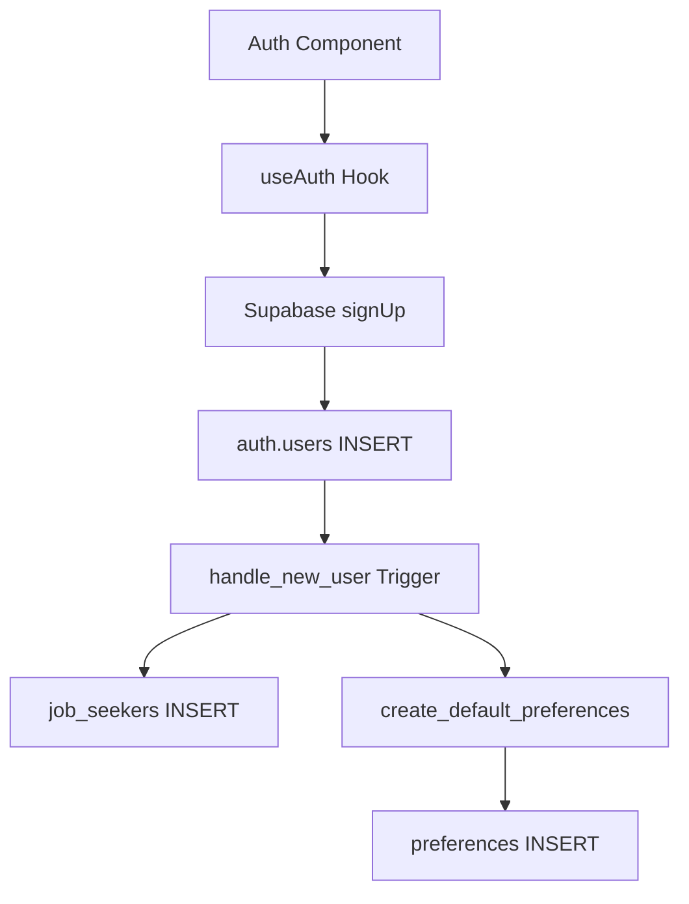
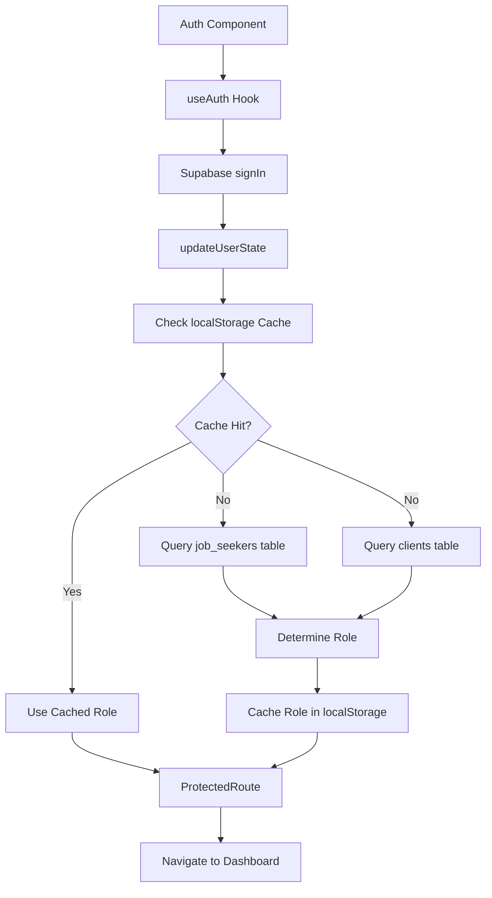
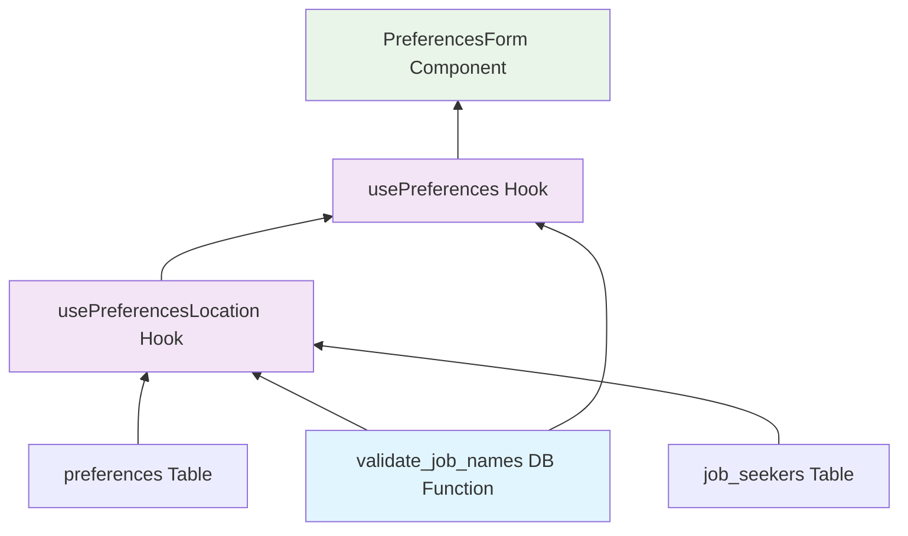
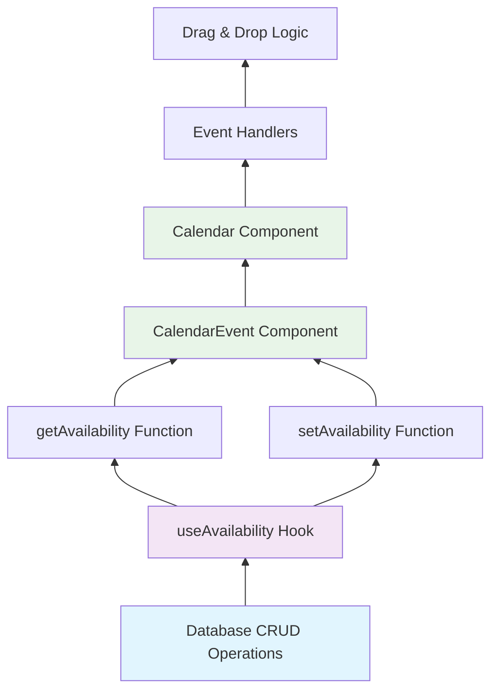
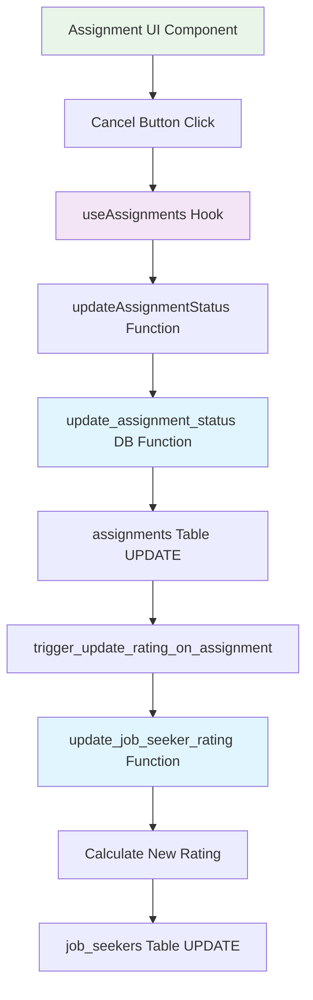
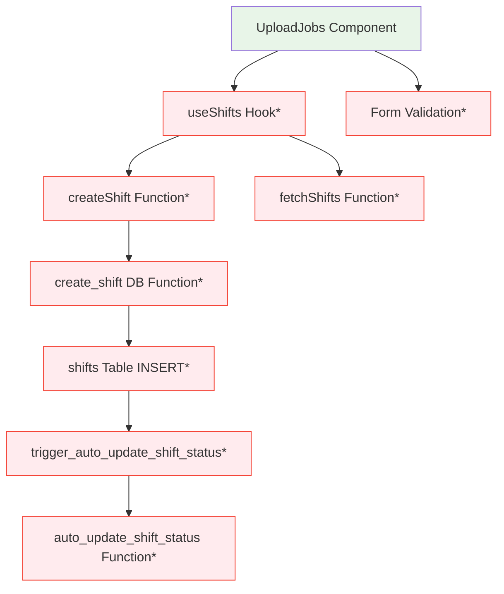
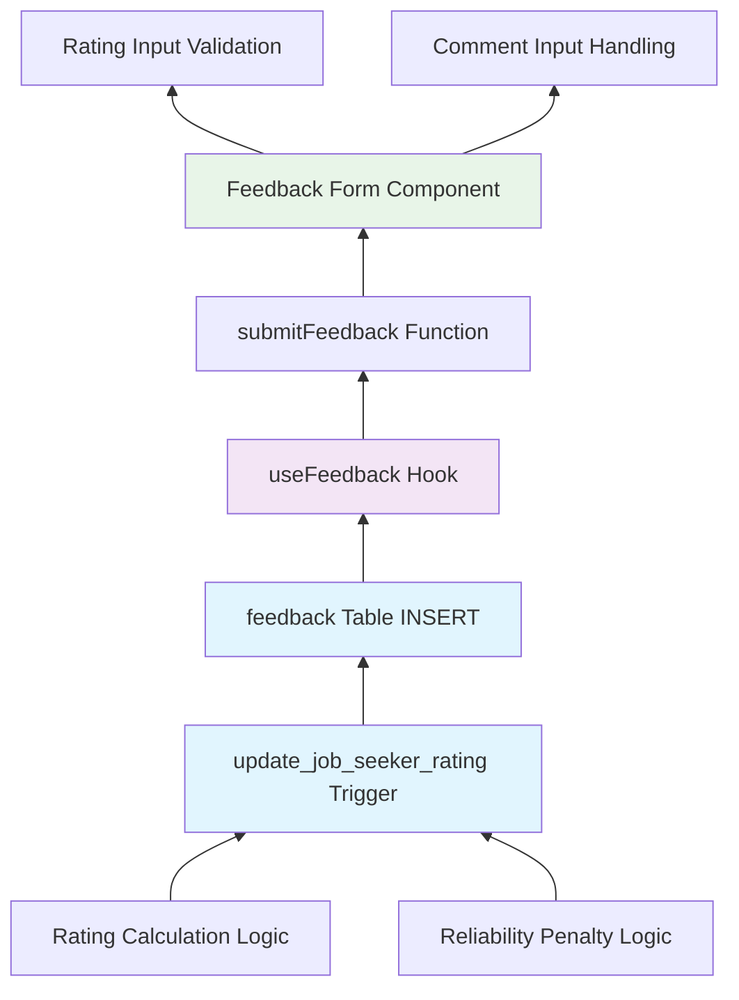
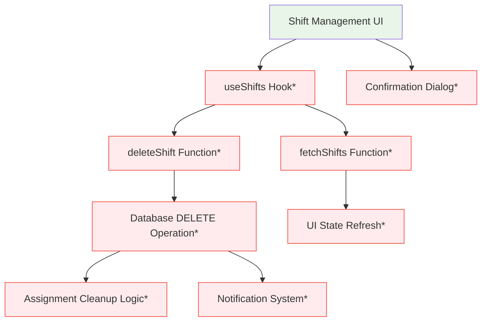

# OptiStaff Testing Plan - Project Meeting 3

## Testing Framework and Tools

**Testing Framework**: Vitest for JavaScript/TypeScript testing (current project setup)
**Database Function Testing**: Vitest + Supabase test client for database function unit tests
**Integration Testing**: Vitest + Supabase test client for hook and component integration
**Frontend Testing**: Vitest + React Testing Library for component testing
**Existing Test Structure**: Tests organized in `tests/unit/`, `tests/frontendSuccessUnit/`, and `tests/integration/`

---

## Unit Test Cases

### UC1: Create Account - Unit Test

| Test Case ID         | TC-UC1-U1                                                                      |
| -------------------- | ------------------------------------------------------------------------------ |
| **Feature**          | Email Validation Logic                                                         |
| **Component**        | `src/utils/authentication.tsx` - `isValidEmail()` function                     |
| **Test Description** | Verify email validation logic accepts valid emails and rejects invalid formats |
| **Input**            | Valid email: "user@example.com", Invalid email: "invalid-email"                |
| **Expected Output**  | Valid: `true`, Invalid: `false`                                                |
| **Test Type**        | Unit Test                                                                      |

| Test Case ID         | TC-UC1-U2                                                               |
| -------------------- | ----------------------------------------------------------------------- |
| **Feature**          | Password Validation Logic                                               |
| **Component**        | `src/utils/authentication.tsx` - `isValidPassword()` function           |
| **Test Description** | Test password validation requirements (minimum 6 characters, uppercase) |
| **Input**            | Valid: "Password123", Invalid: "pass"                                   |
| **Expected Output**  | Valid: `true`, Invalid: `false`                                         |
| **Test Type**        | Unit Test                                                               |

| Test Case ID         | TC-UC1-U3                                                                                                         |
| -------------------- | ----------------------------------------------------------------------------------------------------------------- |
| **Feature**          | Signup Function                                                                                                   |
| **Component**        | `src/hooks/useAuth.tsx` - `signup()` function                                                                     |
| **Test Description** | Test user registration with complete signup data                                                                  |
| **Input**            | `{email: "test@example.com", password: "Password123", userType: "jobseeker", firstName: "John", lastName: "Doe"}` |
| **Expected Output**  | User account created, navigation to preferences page                                                              |
| **Test Type**        | Unit Test                                                                                                         |

### UC2: Sign In - Unit Test

| Test Case ID         | TC-UC2-U1                                                                         |
| -------------------- | --------------------------------------------------------------------------------- |
| **Feature**          | Authentication Login Function                                                     |
| **Component**        | `src/hooks/useAuth.tsx` - `login()` function                                      |
| **Test Description** | Test sign-in function with valid credentials returns user object                  |
| **Input**            | `{email: "test@example.com", password: "validPassword123"}`                       |
| **Expected Output**  | `{user: {id: "uuid", email: "test@example.com", role: "jobseeker"}, error: null}` |
| **Test Type**        | Unit Test                                                                         |

| Test Case ID         | TC-UC2-U2                                                  |
| -------------------- | ---------------------------------------------------------- |
| **Feature**          | User Role Detection                                        |
| **Component**        | `src/hooks/useAuth.tsx` - `updateUserState()` function     |
| **Test Description** | Test role detection from user metadata and database lookup |
| **Input**            | User with metadata: `{user_type: "job-seeker"}`            |
| **Expected Output**  | Role set to "jobseeker", navigation to preferences         |
| **Test Type**        | Unit Test                                                  |

| Test Case ID         | TC-UC2-U3                                                                        |
| -------------------- | -------------------------------------------------------------------------------- |
| **Feature**          | Authentication State Management                                                  |
| **Component**        | `src/hooks/useAuth.tsx` - `authState` management                                 |
| **Test Description** | Test authentication state updates correctly with loading, user, and error states |
| **Input**            | Supabase auth session change event                                               |
| **Expected Output**  | `{user: SupabaseUser, loading: false, error: null}`                              |
| **Test Type**        | Unit Test                                                                        |

### UC3: Set Preferences - Unit Test

| Test Case ID         | TC-UC3-U1                                                                                     |
| -------------------- | --------------------------------------------------------------------------------------------- |
| **Feature**          | Preferences Validation                                                                        |
| **Component**        | `src/utils/preferencesValidator.ts` - `validatePreferences()` function                        |
| **Test Description** | Validate preference constraints (pay rate >= 0, max hours <= 44, Singapore labor law)         |
| **Input**            | `{min_pay_rate: 15.50, max_hours_per_week: 40, max_travel_km: 25, desired_roles: ["server"]}` |
| **Expected Output**  | `{isValid: true, errors: []}`                                                                 |
| **Test Type**        | Unit Test                                                                                     |

| Test Case ID         | TC-UC3-U2                                                                             |
| -------------------- | ------------------------------------------------------------------------------------- |
| **Feature**          | Preferences Form State Management                                                     |
| **Component**        | `src/components/PreferencesForm.tsx` - `PreferencesForm` component                    |
| **Test Description** | Test form data state updates and submission handling                                  |
| **Input**            | Form data updates: `{payRate: 20, maxHoursPerWeek: 40, selectedJobNames: ["waiter"]}` |
| **Expected Output**  | Form state updated, submit button enabled                                             |
| **Test Type**        | Unit Test                                                                             |

| Test Case ID         | TC-UC3-U3                                                       |
| -------------------- | --------------------------------------------------------------- |
| **Feature**          | Preferences Update Function                                     |
| **Component**        | `src/hooks/usePreferences.tsx` - `updatePreferences()` function |
| **Test Description** | Test updating user preferences in database                      |
| **Input**            | Preference updates: `{min_pay_rate: 18.00, max_travel_km: 20}`  |
| **Expected Output**  | Database updated, function returns `true`                       |
| **Test Type**        | Unit Test                                                       |

### UC4: Indicate Availability - Unit Test

| Test Case ID         | TC-UC4-U1                                                                       |
| -------------------- | ------------------------------------------------------------------------------- |
| **Feature**          | Calendar Time Slot Creation                                                     |
| **Component**        | `src/components/Calendar.tsx` - `handleDoubleClick()` function                  |
| **Test Description** | Test creating new availability slot on calendar double-click                    |
| **Input**            | Double-click on Monday 9AM slot                                                 |
| **Expected Output**  | New time slot created: `{startTime: "09:00", endTime: "10:00", day_of_week: 1}` |
| **Test Type**        | Unit Test                                                                       |

| Test Case ID         | TC-UC4-U2                                                                                                    |
| -------------------- | ------------------------------------------------------------------------------------------------------------ |
| **Feature**          | Availability Time Slot Validation                                                                            |
| **Component**        | `src/hooks/useAvailability.tsx` - `setAvailability()` function                                               |
| **Test Description** | Test availability saving with validation and database operations                                             |
| **Input**            | Time blocks: `[{start_time: "2025-08-01T09:00", end_time: "2025-08-01T17:00", submission_cycle: "PRIMARY"}]` |
| **Expected Output**  | Database records created, function returns `true`                                                            |
| **Test Type**        | Unit Test                                                                                                    |

| Test Case ID         | TC-UC4-U3                                                                                 |
| -------------------- | ----------------------------------------------------------------------------------------- |
| **Feature**          | Calendar Event Management                                                                 |
| **Component**        | `src/components/Calendar.tsx` - `handleUpdateEvent()` and `handleDeleteEvent()` functions |
| **Test Description** | Test updating and deleting calendar events                                                |
| **Input**            | Event update/delete operations                                                            |
| **Expected Output**  | Events array updated correctly                                                            |
| **Test Type**        | Unit Test                                                                                 |

### UC5: Cancel Shift - Unit Test

| Test Case ID         | TC-UC5-U1                                                            |
| -------------------- | -------------------------------------------------------------------- |
| **Feature**          | Assignment Status Update                                             |
| **Component**        | `src/hooks/useAssignments.tsx` - `updateAssignmentStatus()` function |
| **Test Description** | Test assignment status change from confirmed to cancelled by user    |
| **Input**            | `{assignmentId: "uuid", status_name: "CancelByJobseeker"}`           |
| **Expected Output**  | `{updated_count: 1, payout_created: false}`                          |
| **Test Type**        | Unit Test                                                            |

| Test Case ID         | TC-UC5-U2                                                      |
| -------------------- | -------------------------------------------------------------- |
| **Feature**          | Assignment Data Fetching                                       |
| **Component**        | `src/hooks/useAssignments.tsx` - `fetchAssignments()` function |
| **Test Description** | Test fetching user assignments for display                     |
| **Input**            | Authenticated user ID                                          |
| **Expected Output**  | Array of user assignments loaded                               |
| **Test Type**        | Unit Test                                                      |

| Test Case ID         | TC-UC5-U3                                                       |
| -------------------- | --------------------------------------------------------------- |
| **Feature**          | Assignment UI Component                                         |
| **Component**        | Assignment UI Component - Cancel button handling                |
| **Test Description** | Test assignment cancellation UI interaction and state updates   |
| **Input**            | Click cancel button on assignment card                          |
| **Expected Output**  | Confirmation dialog shown, assignment status updated on confirm |
| **Test Type**        | Unit Test                                                       |

### UC6: List Jobs - Unit Test

| Test Case ID         | TC-UC6-U1                                                                                                              |
| -------------------- | ---------------------------------------------------------------------------------------------------------------------- |
| **Feature**          | Shift Creation Validation                                                                                              |
| **Component**        | `src/hooks/useShifts.tsx` - `createShift()` function                                                                   |
| **Test Description** | Validate shift data before creation (end time after start time, positive pay rate)                                     |
| **Input**            | `{title: "Server", start_time: new Date("2025-08-01T09:00"), end_time: new Date("2025-08-01T17:00"), pay_rate: 18.50}` |
| **Expected Output**  | Shift created successfully, database record inserted                                                                   |
| **Test Type**        | Unit Test                                                                                                              |

| Test Case ID         | TC-UC6-U2                                            |
| -------------------- | ---------------------------------------------------- |
| **Feature**          | Shift Data Management                                |
| **Component**        | `src/hooks/useShifts.tsx` - `fetchShifts()` function |
| **Test Description** | Test fetching shifts for employer dashboard          |
| **Input**            | Employer user ID                                     |
| **Expected Output**  | Array of employer's shifts loaded                    |
| **Test Type**        | Unit Test                                            |

| Test Case ID         | TC-UC6-U3                                                       |
| -------------------- | --------------------------------------------------------------- |
| **Feature**          | Job Upload Form Component                                       |
| **Component**        | Job Upload Form Component - Form validation and submission      |
| **Test Description** | Test job posting form validation and submission handling        |
| **Input**            | Form data with required fields filled                           |
| **Expected Output**  | Form validates successfully, submission triggers shift creation |
| **Test Type**        | Unit Test                                                       |

### UC7: Review Employee - Unit Test

| Test Case ID         | TC-UC7-U1                                                        |
| -------------------- | ---------------------------------------------------------------- |
| **Feature**          | Feedback Submission                                              |
| **Component**        | `src/hooks/useFeedback.tsx` - `submitFeedback()` function        |
| **Test Description** | Test employee feedback submission with rating and comment        |
| **Input**            | `{rating_score: 4, comment: "Good work", assignment_id: "uuid"}` |
| **Expected Output**  | Feedback record created in database                              |
| **Test Type**        | Unit Test                                                        |

| Test Case ID         | TC-UC7-U2                                                |
| -------------------- | -------------------------------------------------------- |
| **Feature**          | Feedback Data Management                                 |
| **Component**        | `src/hooks/useFeedback.tsx` - `fetchFeedback()` function |
| **Test Description** | Test fetching feedback records for reviewer              |
| **Input**            | Reviewer user ID                                         |
| **Expected Output**  | Array of feedback records loaded                         |
| **Test Type**        | Unit Test                                                |

| Test Case ID         | TC-UC7-U3                                                   |
| -------------------- | ----------------------------------------------------------- |
| **Feature**          | Feedback Form Component                                     |
| **Component**        | Feedback Form Component - Rating input and comment handling |
| **Test Description** | Test feedback form UI interactions and validation           |
| **Input**            | Rating selection and comment input                          |
| **Expected Output**  | Form state updated, submit button enabled when valid        |
| **Test Type**        | Unit Test                                                   |

### UC8: Employer Cancels Job Listing - Unit Test

| Test Case ID         | TC-UC8-U1                                            |
| -------------------- | ---------------------------------------------------- |
| **Feature**          | Shift Deletion                                       |
| **Component**        | `src/hooks/useShifts.tsx` - `deleteShift()` function |
| **Test Description** | Test shift deletion and database cleanup             |
| **Input**            | `{shift_id: "uuid"}`                                 |
| **Expected Output**  | Shift removed from database, shifts list refreshed   |
| **Test Type**        | Unit Test                                            |

| Test Case ID         | TC-UC8-U2                                            |
| -------------------- | ---------------------------------------------------- |
| **Feature**          | Shift Status Update                                  |
| **Component**        | `src/hooks/useShifts.tsx` - `updateShift()` function |
| **Test Description** | Test updating shift status to cancelled              |
| **Input**            | `{shift_id: "uuid", status: "CANCELLED"}`            |
| **Expected Output**  | Shift status updated in database                     |
| **Test Type**        | Unit Test                                            |

| Test Case ID         | TC-UC8-U3                                                        |
| -------------------- | ---------------------------------------------------------------- |
| **Feature**          | Shift Management UI Component                                    |
| **Component**        | Shift Management UI Component - Delete confirmation and handling |
| **Test Description** | Test shift deletion UI flow with confirmation dialog             |
| **Input**            | Click delete button on shift listing                             |
| **Expected Output**  | Confirmation dialog shown, shift deleted on confirm              |
| **Test Type**        | Unit Test                                                        |

---

## Integration Test Cases

### UC1: Create Account - Integration Test

| Test Case ID             | TC-UC1-I1                                                                                                                        |
| ------------------------ | -------------------------------------------------------------------------------------------------------------------------------- |
| **Feature**              | Complete User Registration Flow with Database Trigger                                                                            |
| **Components**           | Auth Page → useAuth Hook → Supabase Auth → `handle_new_user()` trigger → Database Tables                                         |
| **Test Description**     | Test end-to-end user registration triggering automatic profile and preferences creation                                          |
| **Integration Strategy** | **Call Graph-based, Top-down**: Start from Auth component, integrate through authentication to database triggers                 |
| **Input**                | Form data: `{email: "newuser@test.com", password: "password123", user_type: "job-seeker", first_name: "John", last_name: "Doe"}` |
| **Expected Output**      | User record in `auth.users`, job seeker record in `job_seekers`, default preferences created via `create_default_preferences()`  |
| **Test Type**            | Integration Test                                                                                                                 |

**Strategy Explanation**: Using **Call Graph-based, Top-down** approach because the execution flow follows function calls rather than code structure. We start from the Auth component (top level) and progressively integrate real implementations moving down the call chain: Auth → useAuth → Supabase Auth → Database Triggers. Initially mock the database triggers, then replace with real implementations.

**Call Graph**:

### UC2: Sign In - Integration Test

| Test Case ID             | TC-UC2-I1                                                                                                 |
| ------------------------ | --------------------------------------------------------------------------------------------------------- |
| **Feature**              | Authentication Flow with Role Caching and Navigation                                                      |
| **Components**           | Auth Page → useAuth Hook → Role Detection → localStorage Cache → ProtectedRoute → Dashboard               |
| **Test Description**     | Test complete sign-in flow with role caching optimization and proper navigation                           |
| **Integration Strategy** | **Call Graph-based, Top-down**: Start from Auth component, integrate role detection and caching system    |
| **Input**                | `{email: "employer@test.com", password: "validpass"}`                                                     |
| **Expected Output**      | User authenticated, role detected from database, cached in localStorage, redirected to employer dashboard |
| **Test Type**            | Integration Test                                                                                          |

**Strategy Explanation**: Using **Call Graph-based, Top-down** approach because the authentication flow follows a clear execution path with function calls and state updates. We start from the Auth component and progressively integrate each step: authentication → role detection → caching → navigation. Mock the database queries initially, then integrate real role detection logic.

**Call Graph**:

### UC3: Set Preferences - Integration Test

| Test Case ID             | TC-UC3-I1                                                                                                              |
| ------------------------ | ---------------------------------------------------------------------------------------------------------------------- |
| **Feature**              | Preferences Management with Location Integration                                                                       |
| **Components**           | PreferencesForm → usePreferences Hook → usePreferencesLocation Hook → Database                                         |
| **Test Description**     | Test preferences saving with job name validation and location data integration                                         |
| **Integration Strategy** | **Decomposition-based, Bottom-up**: Start with database validation functions, integrate location and preferences hooks |
| **Input**                | Preferences: `{min_pay_rate: 20.00, max_travel_km: 30, desired_roles: ["Waiter/Waitress", "Kitchen Helper"]}`          |
| **Expected Output**      | Job names validated via `validate_job_names()`, preferences saved with location data, form success state               |
| **Test Type**            | Integration Test                                                                                                       |

**Strategy Explanation**: Using **Decomposition-based, Bottom-up** approach because we follow the modular structure where usePreferences depends on usePreferencesLocation. We start testing the leaf components (database functions, location hook) first, then integrate upward to the preferences hook, and finally the form component. This allows us to reuse unit test drivers as we move up the hierarchy.

**Component Hierarchy**:

### UC4: Indicate Availability - Integration Test

| Test Case ID             | TC-UC4-I1                                                                                                    |
| ------------------------ | ------------------------------------------------------------------------------------------------------------ |
| **Feature**              | Calendar Availability with Database Synchronization                                                          |
| **Components**           | Calendar Component → CalendarEvent Component → useAvailability Hook → Database                               |
| **Test Description**     | Test interactive calendar with drag-and-drop events synchronized to database                                 |
| **Integration Strategy** | **Call Graph-based, Bottom-up**: Start with database operations, integrate calendar UI with event handling   |
| **Input**                | Time blocks: `[{start_time: "2025-08-01T09:00", end_time: "2025-08-01T17:00", submission_cycle: "PRIMARY"}]` |
| **Expected Output**      | Availability records created in database, calendar events rendered, drag-and-drop functionality working      |
| **Test Type**            | Integration Test                                                                                             |

**Strategy Explanation**: Using **Call Graph-based, Bottom-up** approach because the calendar functionality follows execution flow rather than code structure. We start with database operations (leaf functions), then integrate the useAvailability hook, followed by CalendarEvent components, and finally the Calendar component. This allows us to use unit test drivers for database operations and build upward.

**Call Graph (Bottom-up Integration)**:

### UC5: Cancel Shift - Integration Test

| Test Case ID             | TC-UC5-I1                                                                                                 |
| ------------------------ | --------------------------------------------------------------------------------------------------------- |
| **Feature**              | Assignment Cancellation with Automatic Rating Update                                                      |
| **Components**           | Assignment UI → useAssignments Hook → `update_assignment_status()` → `update_job_seeker_rating()` trigger |
| **Test Description**     | Test assignment cancellation triggering automatic rating penalty calculation                              |
| **Integration Strategy** | **Call Graph-based, Top-down**: Start from UI component, integrate through database function to trigger   |
| **Input**                | `{assignment_id: "uuid", status_name: "CANCELLED_BY_USER"}`                                               |
| **Expected Output**      | Assignment status updated, `update_job_seeker_rating()` trigger fired, rating reduced by 0.1 points       |
| **Test Type**            | Integration Test                                                                                          |

**Strategy Explanation**: Using **Call Graph-based, Top-down** approach because the cancellation flow follows a clear execution path from UI action to database trigger. We start from the Assignment UI component (top level) and progressively integrate real implementations moving down: UI → Hook → Database Function → Trigger. Initially mock the database trigger, then replace with real implementation to test the complete flow.

**Call Graph**:

### UC6: List Jobs - Integration Test

| Test Case ID             | TC-UC6-I1                                                                                                                       |
| ------------------------ | ------------------------------------------------------------------------------------------------------------------------------- |
| **Feature**              | Shift Creation with Automatic Status Management                                                                                 |
| **Components**           | UploadJobs Component → useShifts Hook → `create_shift()` → `auto_update_shift_status()` trigger                                 |
| **Test Description**     | Test complete shift creation flow with automatic status management                                                              |
| **Integration Strategy** | **Decomposition-based, Top-down**: Start from UI form, integrate through database function to triggers                          |
| **Input**                | Shift data: `{client_id: "uuid", title: "Restaurant Server", start_time: "2025-08-01T11:00", pay_rate: 18.50, staff_needed: 3}` |
| **Expected Output**      | Shift created via `create_shift()`, status set to OPEN (1), `fetchShifts()` refreshes UI                                        |
| **Test Type**            | Integration Test                                                                                                                |

**Strategy Explanation**: Using **Decomposition-based, Top-down** approach because we follow the modular structure of the system design. We start from the UploadJobs component (main program) and mock all sub-components below it initially. Then we progressively replace mocked components with real implementations following breadth-first order: Form → Hook → Database Function → Triggers.

**Component Structure (Top-down Integration)**:

_Note: Components marked with _ are initially mocked, then progressively integrated\*

### UC7: Review Employee - Integration Test

| Test Case ID             | TC-UC7-I1                                                                                                           |
| ------------------------ | ------------------------------------------------------------------------------------------------------------------- |
| **Feature**              | Feedback Submission with Rating Recalculation                                                                       |
| **Components**           | Feedback Form → useFeedback Hook → Database Insert → `update_job_seeker_rating()` trigger                           |
| **Test Description**     | Test feedback submission triggering automatic job seeker rating recalculation                                       |
| **Integration Strategy** | **Call Graph-based, Bottom-up**: Start with database trigger, integrate feedback submission flow                    |
| **Input**                | `{assignment_id: "uuid", rating_score: 4, comment: "Punctual and professional", review_type: "CLIENT_TO_EMPLOYEE"}` |
| **Expected Output**      | Feedback record created, `update_job_seeker_rating()` trigger calculates new average rating                         |
| **Test Type**            | Integration Test                                                                                                    |

**Strategy Explanation**: Using **Call Graph-based, Bottom-up** approach because we want to ensure the rating calculation trigger works correctly before testing the UI flow. We start with the database trigger (leaf function), then integrate the database insert operation, followed by the hook, and finally the form component. This allows us to use unit test drivers for the trigger and build confidence upward.

**Call Graph (Bottom-up Integration)**:

### UC8: Employer Cancels Job Listing - Integration Test

| Test Case ID             | TC-UC8-I1                                                                                                |
| ------------------------ | -------------------------------------------------------------------------------------------------------- |
| **Feature**              | Shift Deletion with Assignment Cleanup                                                                   |
| **Components**           | Shift Management UI → useShifts Hook → Database Delete → Assignment Notifications                        |
| **Test Description**     | Test shift deletion with proper cleanup of related assignments and notifications                         |
| **Integration Strategy** | **Decomposition-based, Top-down**: Start from management UI, integrate deletion with assignment handling |
| **Input**                | `{shift_id: "uuid"}` with existing assignments                                                           |
| **Expected Output**      | Shift deleted, related assignments updated, `fetchShifts()` refreshes UI, loading states managed         |
| **Test Type**            | Integration Test                                                                                         |

**Strategy Explanation**: Using **Decomposition-based, Top-down** approach because we follow the modular structure where the Shift Management UI is the main component that depends on multiple sub-components for deletion logic. We start from the UI component and mock all sub-components initially, then progressively integrate real implementations: UI → Hook → Database Operations → Notification System.

**Component Structure (Top-down Integration)**:

_Note: Components marked with _ are initially mocked, then progressively integrated following breadth-first order\*

---

## Testing Timeline (3 Weeks)

### Week 11: Unit Testing Implementation

- **Days 1-2**: Set up testing infrastructure (Jest, Vitest configuration)
- **Days 3-4**: Implement unit tests for UC1-UC4 (Authentication, Preferences, Availability)
- **Days 5-7**: Implement unit tests for UC5-UC8 (Assignments, Shifts, Feedback)
- **Deliverable**: All 8 unit test suites completed and passing

### Week 12: Integration Testing Implementation

- **Days 1-2**: Set up integration testing environment (test database, Supertest)
- **Days 3-4**: Implement integration tests for UC1-UC4 using specified strategies
- **Days 5-7**: Implement integration tests for UC5-UC8 using specified strategies
- **Deliverable**: All 8 integration test suites completed and passing

### Week 13: Test Execution and Documentation

- **Days 1-2**: Execute all test suites, fix any failing tests
- **Days 3-4**: Generate test coverage reports and performance metrics
- **Days 5-7**: Document test results, create final testing report
- **Deliverable**: Complete test execution report with coverage analysis

---

## Testing Tools and Frameworks Summary

| Testing Level                 | Tool/Framework                 | Purpose                                                      |
| ----------------------------- | ------------------------------ | ------------------------------------------------------------ |
| **Unit Testing**              | Vitest                         | Hook and function testing (current setup)                    |
| **Database Function Testing** | Vitest + Supabase Test Client  | Database function unit tests (existing in `tests/unit/`)     |
| **Integration Testing**       | Vitest + Supabase Test Client  | Hook and component integration                               |
| **Frontend Testing**          | Vitest + React Testing Library | Component testing (existing in `tests/frontendSuccessUnit/`) |
| **Coverage Analysis**         | Vitest Coverage                | Code coverage reporting                                      |

---

## Success Criteria

- **Unit Tests**: 100% of core functions tested with >90% code coverage
- **Integration Tests**: All 8 use case flows tested end-to-end
- **Test Execution**: All tests pass consistently in CI/CD environment
- **Documentation**: Complete test documentation in table format as required
- **Timeline Adherence**: All testing phases completed within 3-week timeline

This testing plan ensures comprehensive coverage of all use cases while meeting the academic requirements for systematic testing approach documentation.
