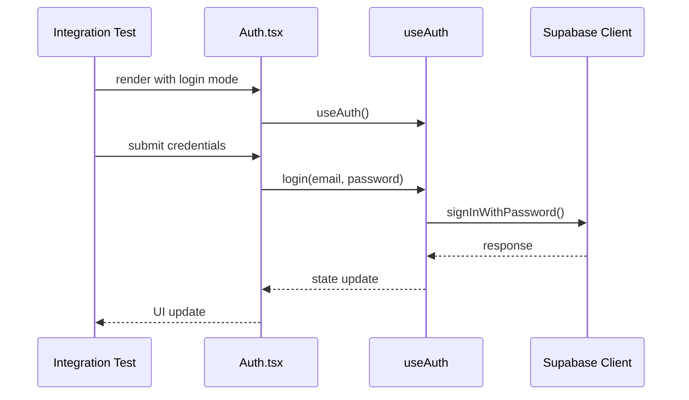
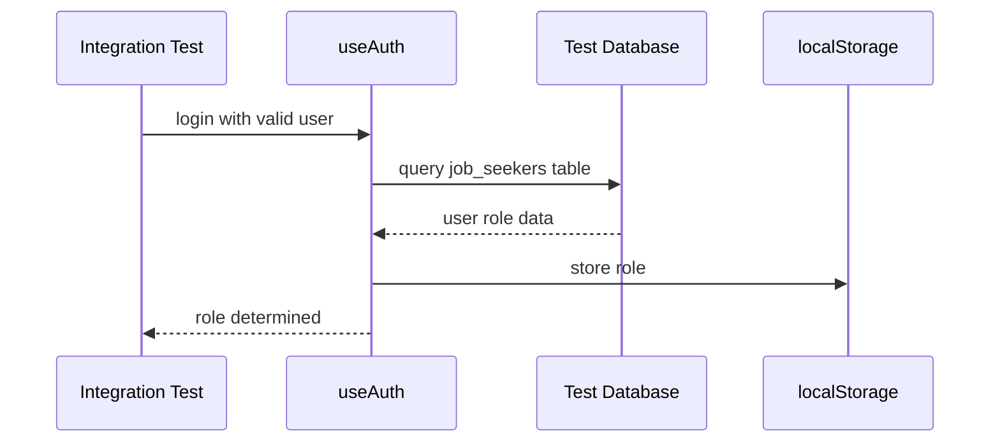
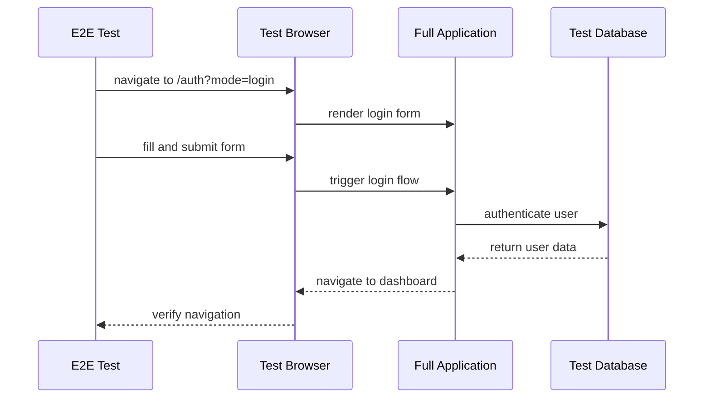

# Use Case 2: Sign In - Integration Test Plan

## Integration Test Call Graph

```mermaid
graph TD
    %% Test Setup Layer
    A[Integration Test Suite] --> B[Test Database Setup]
    A --> C[Mock User Data Creation]
    
    %% Authentication Flow Testing
    A --> D[Auth.tsx Component Tests]
    D --> E[Form Rendering Tests]
    D --> F[Form Submission Tests]
    D --> G[Error Display Tests]
    D --> H[Success Message Tests]
    
    %% Hook Integration Testing
    A --> I[useAuth Hook Tests]
    I --> J[login() Function Tests]
    I --> K[updateUserState() Tests]
    I --> L[Role Determination Tests]
    I --> M[Navigation Logic Tests]
    
    %% Supabase Integration Testing
    A --> N[Supabase Auth Tests]
    N --> O[signInWithPassword() Tests]
    N --> P[Session Management Tests]
    N --> Q[Error Response Tests]
    
    %% End-to-End Flow Testing
    A --> R[E2E Integration Tests]
    R --> S[Valid Credentials Flow]
    R --> T[Invalid Credentials Flow]
    R --> U[Unverified Email Flow]
    R --> V[Role-based Navigation Flow]
    
    %% Database Integration
    A --> W[Database Role Tests]
    W --> X[job_seekers Table Query]
    W --> Y[clients Table Query]
    W --> Z[Role Caching Tests]
    
    %% Component Integration
    D --> AA[AuthHeader Integration]
    D --> AB[AuthFooter Integration]
    D --> AC[UserTypeToggle Integration]
    D --> AD[AuthFormFields Integration]
    
    %% Navigation Integration
    M --> AE[React Router Integration]
    AE --> AF[/employee/preferences Route]
    AE --> AG[/employer/dashboard Route]
    AE --> AH[Error State Handling]
    
    %% State Management Integration
    I --> AI[useState Integration]
    I --> AJ[useEffect Integration]
    I --> AK[useCallback Integration]
    
    %% Utility Integration
    I --> AL[Authentication Utils]
    AL --> AM[validateSignupForm Integration]
    AL --> AN[formatUserData Integration]
    
    %% Storage Integration
    L --> AO[localStorage Integration]
    AO --> AP[Role Caching]
    AO --> AQ[Role Retrieval]
    
    %% Error Handling Integration
    G --> AR[Error State Management]
    AR --> AS[Invalid Credentials Error]
    AR --> AT[Unverified Email Error]
    AR --> AU[Network Error Handling]
    
    %% Success Flow Integration
    S --> AV[Successful Login Flow]
    AV --> AW[Session Creation]
    AV --> AX[Role Assignment]
    AV --> AY[Dashboard Navigation]
    
    style A fill:#e1f5fe
    style R fill:#f3e5f5
    style N fill:#fff3e0
    style W fill:#e8f5e8
```

## Integration Test Categories

### 1. Component Integration Tests
- **Auth.tsx ↔ useAuth Hook**
- **Auth.tsx ↔ UI Components**
- **Form State ↔ Authentication Logic**

### 2. Hook Integration Tests
- **useAuth ↔ Supabase Client**
- **useAuth ↔ React Router**
- **useAuth ↔ localStorage**

### 3. Database Integration Tests
- **Role Determination ↔ Database Tables**
- **User Metadata ↔ Database Records**
- **Caching ↔ Database Queries**

### 4. External Service Integration Tests
- **Supabase Auth Service**
- **Session Management**
- **Error Response Handling**

## Test Implementation Strategy

### Phase 1: Unit Integration Tests


### Phase 2: Database Integration Tests


### Phase 3: End-to-End Integration Tests


## Test Data Setup

### Mock User Scenarios
1. **Valid Jobseeker**: Registered, verified, in job_seekers table
2. **Valid Employer**: Registered, verified, in clients table
3. **Invalid Credentials**: Wrong email/password combination
4. **Unverified Email**: Registered but email not confirmed
5. **Network Error**: Simulated connection failure

### Database Test State
- Clean test database before each test
- Seed with known user data
- Verify role assignments
- Test caching mechanisms

## Integration Points to Test

### 1. Auth.tsx ↔ useAuth Integration
- Form submission triggers hook methods
- Loading states sync between component and hook
- Error states display correctly
- Success navigation works

### 2. useAuth ↔ Supabase Integration
- Authentication requests format correctly
- Response handling works for all scenarios
- Session management integrates properly
- Error mapping is accurate

### 3. Role Determination Integration
- Database queries execute correctly
- Caching mechanism works
- Fallback logic handles edge cases
- Navigation routes correctly

### 4. State Management Integration
- React state updates propagate
- useEffect dependencies work correctly
- Cleanup functions prevent memory leaks
- Component re-renders appropriately

## Success Criteria

### Integration Test Coverage
- [ ] All component-hook interactions tested
- [ ] All database integration points covered
- [ ] All error scenarios handled
- [ ] All navigation flows verified
- [ ] All caching mechanisms tested

### Performance Integration
- [ ] Database queries complete within timeout
- [ ] Role caching improves subsequent loads
- [ ] No memory leaks in state management
- [ ] Proper cleanup on component unmount

### Error Handling Integration
- [ ] Network errors handled gracefully
- [ ] Database errors don't crash app
- [ ] Invalid states recover properly
- [ ] User feedback is appropriate

This integration test plan ensures all components work together correctly for Use Case 2: Sign In functionality.