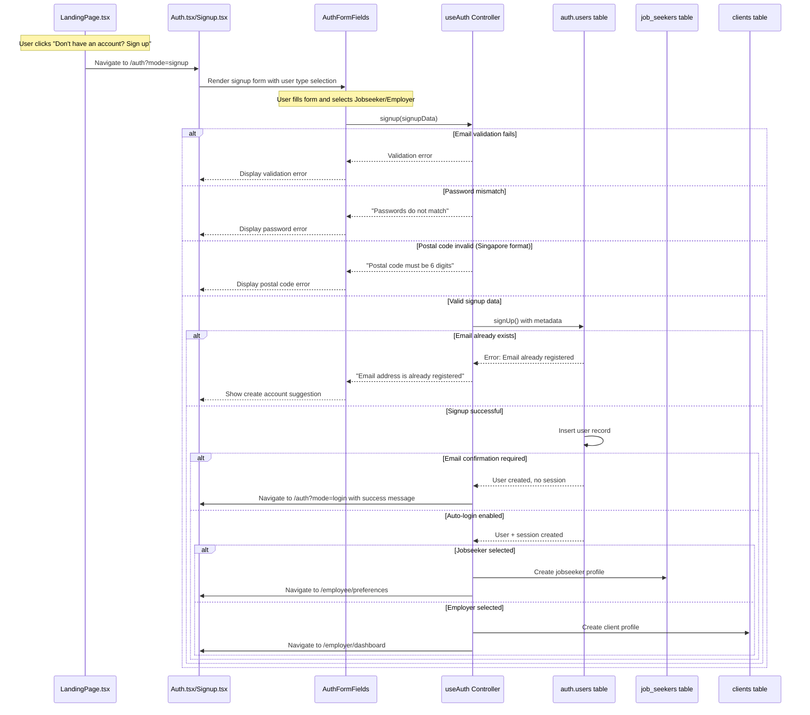
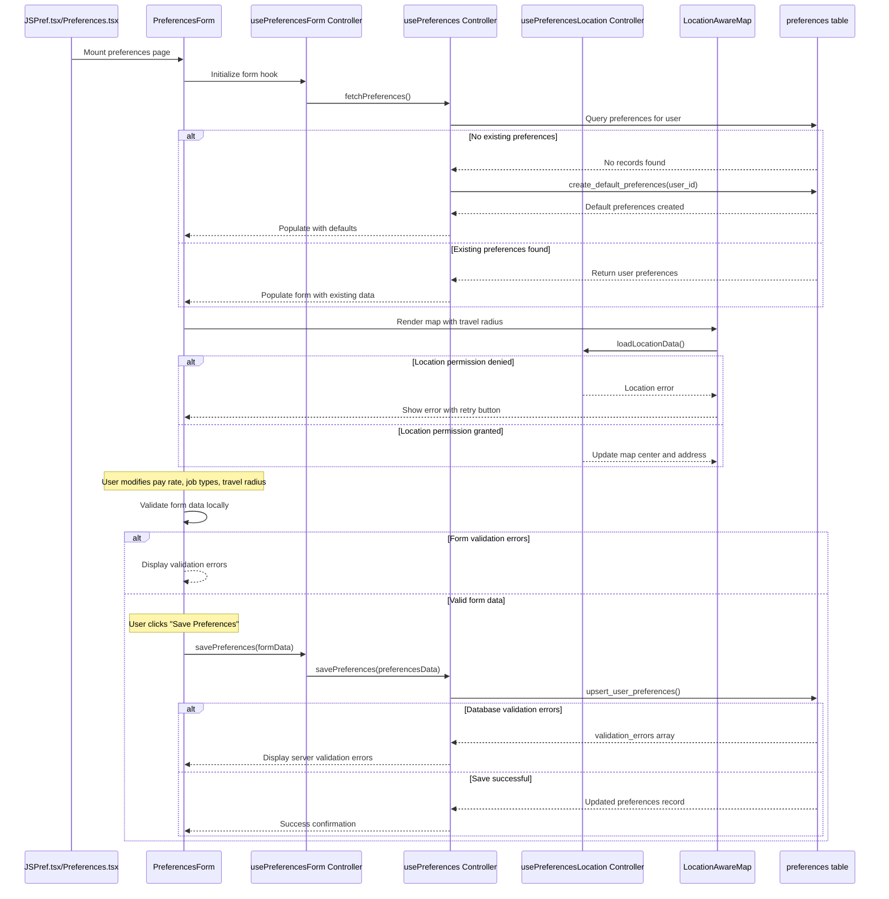
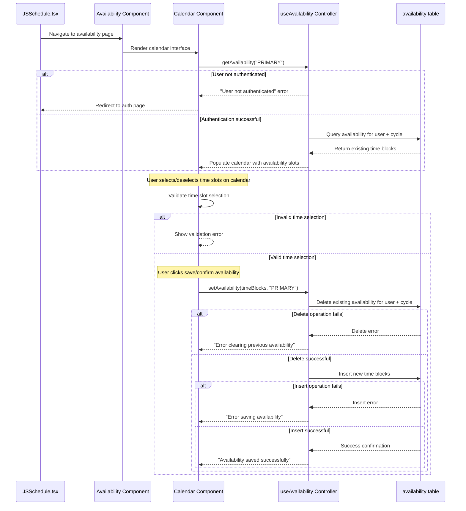
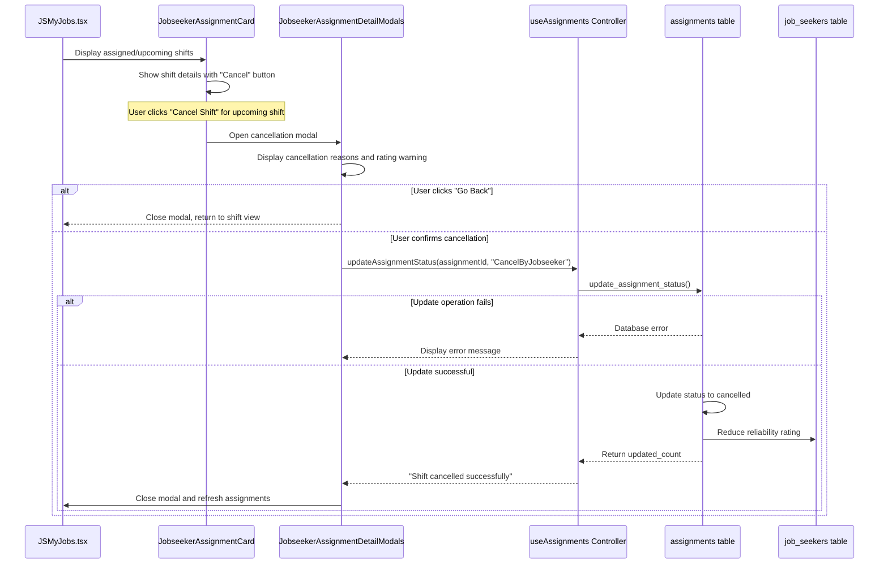
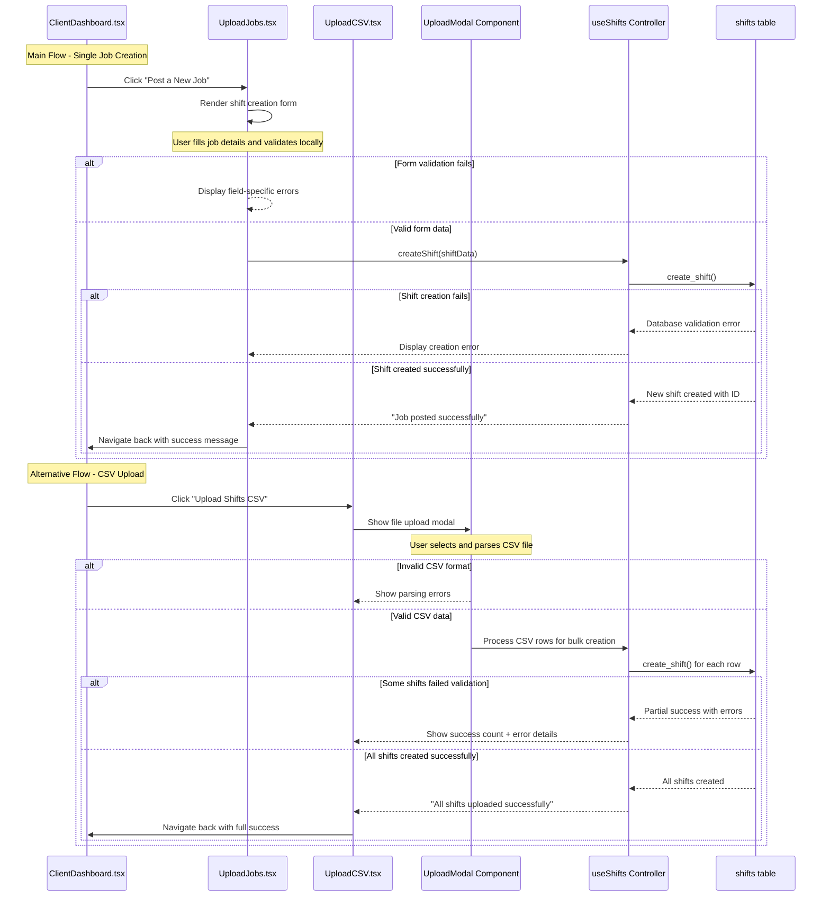
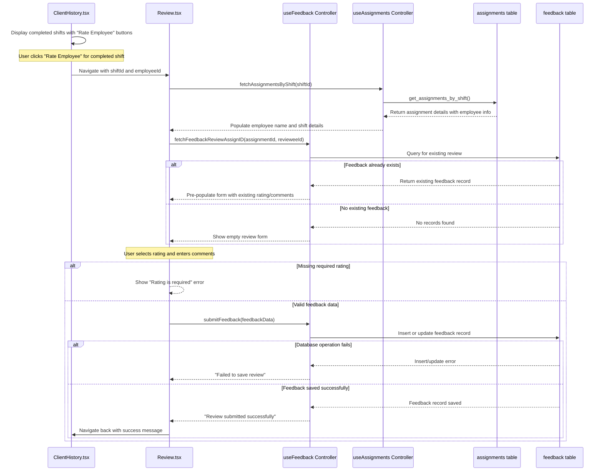
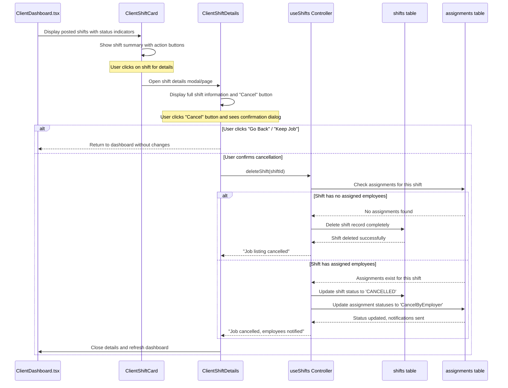

# OptiStaff User Flow Sequence Diagrams

## Overview
This document contains comprehensive user flow sequence diagrams for the OptiStaff platform. Each diagram shows the interaction between specific pages, controller hooks, and database operations, including alternative flows, error handling, and retry mechanisms.

## Controllers (Hooks) Reference
- **useAuth**: Authentication and user management
- **usePreferences**: User preference management
- **usePreferencesForm**: Form-specific preference handling
- **usePreferencesLocation**: Location and geocoding services
- **useAvailability**: Jobseeker availability management
- **useShifts**: Employer shift management
- **useAssignments**: Assignment and booking management
- **useFeedback**: Review and rating system

---

## UC1: Create Account

---

## UC2: Sign In

```mermaid
sequenceDiagram
    participant LandingPage as LandingPage.tsx
    participant Auth as Auth.tsx/Login.tsx
    participant useAuth as useAuth Controller
    participant AuthUsers as auth.users table
    participant JobSeekers as job_seekers table
    participant Clients as clients table

    Note over LandingPage: User clicks "Sign In"
    LandingPage->>Auth: Navigate to /auth?mode=login
    
    Note over Auth: User enters email and password
    Auth->>useAuth: login(email, password)
    
    alt Invalid credentials
        useAuth->>AuthUsers: signInWithPassword()
        AuthUsers-->>useAuth: Invalid login error
        useAuth-->>Auth: Display "Invalid credentials"
        
    else Valid credentials but unverified email
        AuthUsers-->>useAuth: Email not confirmed error
        useAuth-->>Auth: "Please check your email and confirm your account"
        
    else Successful login
        useAuth->>AuthUsers: signInWithPassword()
        AuthUsers-->>useAuth: Return user session
        
        alt Role cached in localStorage
            useAuth-->>Auth: Use cached role for navigation
        else No cached role
            useAuth->>JobSeekers: Query for jobseeker record
            useAuth->>Clients: Query for client record
            
            alt Found in job_seekers
                JobSeekers-->>useAuth: Jobseeker record found
                useAuth->>Auth: Navigate to /employee/preferences
            else Found in clients
                Clients-->>useAuth: Client record found
                useAuth->>Auth: Navigate to /employer/dashboard
            else No role found
                useAuth->>Auth: Navigate to /employee/preferences (default)
            end
        end
    end
```

---

## UC3: Set Preferences

---

## UC4: Indicate Availability

---

## UC5: Cancel Shift

---

## UC6: List Jobs (Create Shifts)

---

## UC7: Review Employee

---

## UC8: Employer Cancels Job Listing

---

## Sub Use Cases for Integration Testing

### Authentication Sub-flows (UC1, UC2)
- **SUC1.1**: Email validation and duplicate checking
  - Test: Valid/invalid email formats
  - Test: Existing vs new email addresses
  - Controller: `useAuth.signup()`

- **SUC1.2**: Password strength validation and confirmation matching
  - Test: Password complexity requirements
  - Test: Password confirmation mismatch scenarios
  - Controller: `useAuth.signup()`

- **SUC1.3**: User type selection and metadata storage
  - Test: Jobseeker vs Employer profile creation
  - Test: Required fields per user type (company name for employers)
  - Controller: `useAuth.signup()`

- **SUC1.4**: Role determination and caching mechanism
  - Test: Database role lookup vs cached role
  - Test: Role-based navigation after login
  - Controller: `useAuth.updateUserState()`

- **SUC2.1**: Session management and persistence
  - Test: Auto-login on page refresh
  - Test: Session timeout handling
  - Controller: `useAuth` useEffect hook

### Preferences Sub-flows (UC3)
- **SUC3.1**: Default preferences creation using database function
  - Test: New user preference initialization
  - Test: Database function `create_default_preferences()`
  - Controller: `usePreferences.createDefaultPreferences()`

- **SUC3.2**: Location permission handling and error states
  - Test: Permission denied scenarios
  - Test: Location service unavailable
  - Controller: `usePreferencesLocation.loadLocationData()`

- **SUC3.3**: Address geocoding and map integration
  - Test: Valid address geocoding
  - Test: Google Maps API integration
  - Controller: `usePreferencesLocation.geocodeHomeLocation()`

- **SUC3.4**: Form validation and error display patterns
  - Test: Client-side vs server-side validation
  - Test: Field-specific error messaging
  - Controller: `usePreferencesForm.savePreferences()`

### Availability Sub-flows (UC4)
- **SUC4.1**: Calendar time slot selection and validation
  - Test: Time slot overlap detection
  - Test: Past date selection prevention
  - Component: `Calendar` with validation logic

- **SUC4.2**: Cycle-based availability management
  - Test: PRIMARY vs SECONDARY cycle handling
  - Test: Cycle-specific data isolation
  - Controller: `useAvailability.getAvailability()`

- **SUC4.3**: Bulk time block operations (delete + insert)
  - Test: Atomic operation success/failure
  - Test: Partial operation rollback
  - Controller: `useAvailability.setAvailability()`

### Assignment Management Sub-flows (UC5)
- **SUC5.1**: Status update with cascading effects
  - Test: Assignment status changes
  - Test: Rating impact calculations
  - Controller: `useAssignments.updateAssignmentStatus()`

- **SUC5.2**: Rating calculation and user profile updates
  - Test: Average rating recalculation
  - Test: Rating impact on future assignments
  - Database: `update_assignment_status()` RPC function

### Shift Management Sub-flows (UC6, UC8)
- **SUC6.1**: Form-based shift creation with validation
  - Test: Required field validation
  - Test: Date/time format validation
  - Controller: `useShifts.createShift()`

- **SUC6.2**: CSV parsing and bulk operation handling
  - Test: CSV format validation
  - Test: Partial success scenarios
  - Component: `UploadModal` with CSV processing

- **SUC8.1**: Assignment-aware cancellation logic
  - Test: Unassigned shift deletion
  - Test: Assigned shift status update with notifications
  - Controller: `useShifts.deleteShift()`

### Feedback Sub-flows (UC7)
- **SUC7.1**: Assignment-feedback relationship validation
  - Test: Feedback linked to specific assignments
  - Test: Duplicate feedback prevention
  - Controller: `useFeedback.fetchFeedbackReviewAssignID()`

- **SUC7.2**: Rating aggregation and profile updates
  - Test: Employee average rating calculation
  - Test: Rating impact on future job assignments
  - Database: Feedback table triggers

---

## Implementation Improvements Identified

### 1. Error Handling Standardization
- Implement consistent error boundary patterns across all page components
- Standardize error message display formats
- Add retry mechanisms for transient failures

### 2. Loading State Management
- Consolidate loading states using global context or state management
- Implement skeleton loading components for better UX
- Add optimistic UI updates for immediate user feedback

### 3. Integration Testing Focus Areas
- **Page-Component-Controller Integration**: Test complete user interaction flows
- **Database Operation Testing**: Mock RPC functions and database responses
- **Navigation Flow Testing**: Validate routing and state preservation between pages
- **Error State Coverage**: Ensure all error paths have corresponding UI states

### 4. Component Architecture Enhancements
- Wrap major page components with error boundaries
- Implement consistent form validation patterns
- Add loading indicators for all async operations
- Consider implementing global state management for cross-page data sharing

This comprehensive documentation provides the foundation for both development and testing of the OptiStaff platform's user interaction flows.