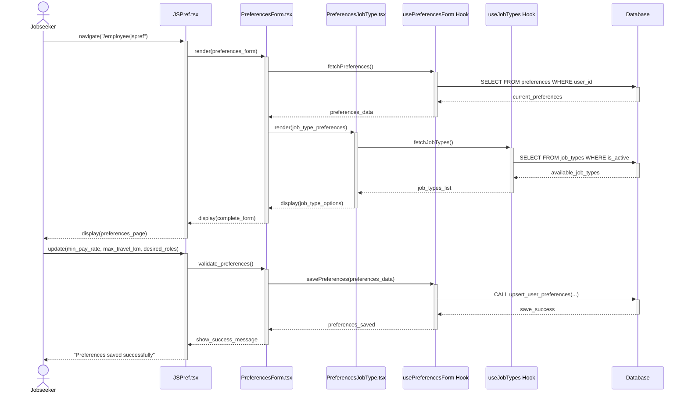
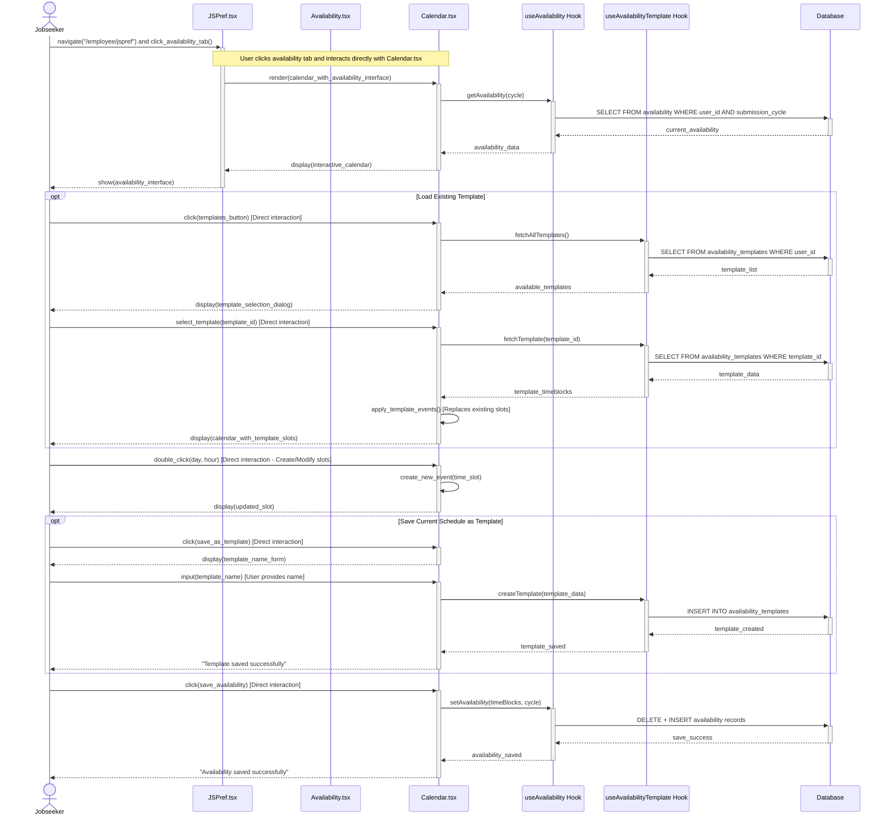
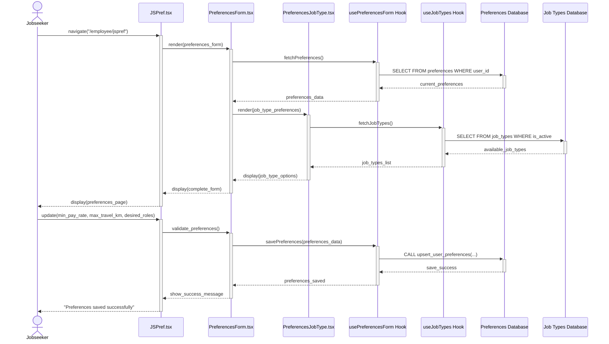
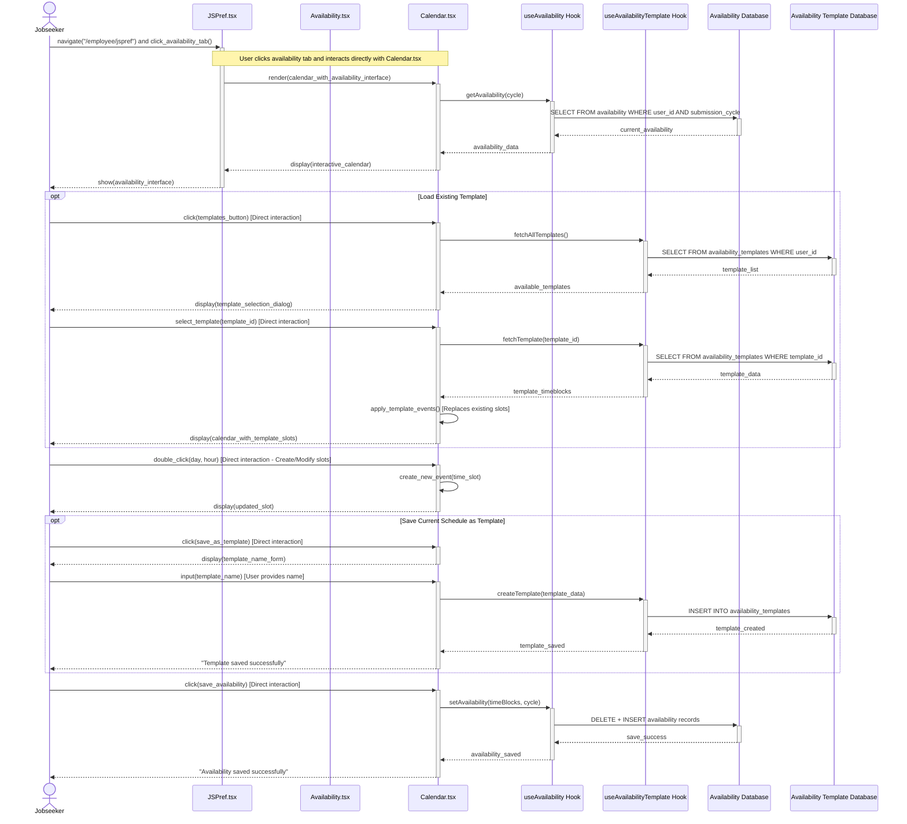

## Use Case 3: Set Preferences (Corrected)

### Components Involved:
- **UI**: `src/pages/employee/JSPref.tsx`
- **Components**: `src/components/PreferencesForm.tsx`, `src/components/PreferencesJobType.tsx`
- **Hook**: `src/hooks/usePreferencesForm.tsx`, `src/hooks/useJobTypes.tsx`
- **Database**: `preferences` table, `job_types` table

### Sequence Diagram:

## Use Case 4: Indicate Availability (Complete Flow with Templates)

### Components Involved:
- **UI**: `src/pages/employee/JSPref.tsx`
- **Components**: `src/components/Availability.tsx`, `src/components/Calendar.tsx`
- **Hook**: `src/hooks/useAvailability.tsx`, `src/hooks/useAvailabilityTemplate.tsx`
- **Database**: `availability` table, `availability_templates` table

### Sequence Diagram:

---

## Updated Sequence Diagrams with Separate Databases

### Use Case 3: Set Preferences (With Separate Databases)

### Components Involved:
- **UI**: `src/pages/employee/JSPref.tsx`
- **Components**: `src/components/PreferencesForm.tsx`, `src/components/PreferencesJobType.tsx`
- **Hook**: `src/hooks/usePreferencesForm.tsx`, `src/hooks/useJobTypes.tsx`
- **Database**: `preferences_db`, `job_types_db`

### Sequence Diagram:

### Use Case 4: Indicate Availability (With Separate Databases)

### Components Involved:
- **UI**: `src/pages/employee/JSPref.tsx`
- **Components**: `src/components/Availability.tsx`, `src/components/Calendar.tsx`
- **Hook**: `src/hooks/useAvailability.tsx`, `src/hooks/useAvailabilityTemplate.tsx`
- **Database**: `availability_db`, `availability_template_db`

### Sequence Diagram:

---

## Use Case Tables

### Use Case 3: Set Preferences

| Field                | Description                                                                                                                                             |
| -------------------- | ------------------------------------------------------------------------------------------------------------------------------------------------------- |
| **ID**               | UC3                                                                                                                                                     |
| **Name**             | Set Preferences                                                                                                                                         |
| **Description**      | Jobseeker sets preferences to be eligible for shifts                                                                                                    |
| **Actors**           | Jobseeker                                                                                                                                               |
| **Triggers**         | Navigates to "Preferences" section of JSPref page                                                                                                       |
| **Preconditions**    | Jobseeker is logged in and authenticated                                                                                                                |
| **Postconditions**   | Preferences saved to `preferences_db`; job types validated against `job_types_db`                                                                      |
| **Error States**     | Invalid job type selection; validation errors                                                                                                           |
| **Flow**             | 1. Enter preferences (pay rate, travel distance, max hours, job types) 2. System validates job types 3. Click "Save Preferences" 4. System confirms save |
| **Alternative Flow** | User can modify existing preferences                                                                                                                     |
| **Database Tables**  | `preferences_db` - stores user preference settings `job_types_db` - validates available job categories                                              |

---

### Use Case 4: Indicate Availability

| Field                | Description                                                                                                                                              |
| -------------------- | -------------------------------------------------------------------------------------------------------------------------------------------------------- |
| **ID**               | UC4                                                                                                                                                      |
| **Name**             | Indicate Availability                                                                                                                                    |
| **Description**      | Jobseeker specifies available days and times with optional template usage                                                                                |
| **Actors**           | Jobseeker                                                                                                                                                |
| **Triggers**         | Navigates to "Availability" tab in JSPref page                                                                                                           |
| **Preconditions**    | Jobseeker is logged in and authenticated                                                                                                                 |
| **Postconditions**   | Availability records saved to `availability_db`; optional templates saved to `availability_template_db`                                                |
| **Error States**     | Template loading failures; availability save conflicts                                                                                                   |
| **Flow**             | 1. Optional: Load existing template 2. Create/modify time slots 3. Optional: Save as template 4. Click "Save Availability" 5. System confirms save |
| **Alternative Flow** | Template workflow: Load template then manually add more slots                                                                                            |
| **Database Tables**  | `availability_db` - stores user time slot availability `availability_template_db` - stores reusable availability templates                          |
