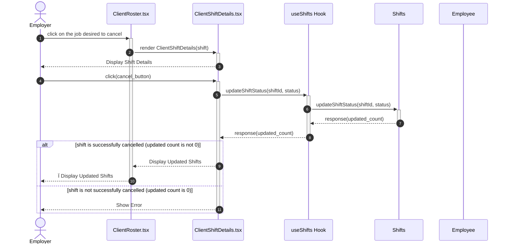

```mermaid
sequenceDiagram
    autonumber
    actor Employer as Employer
    participant ClientRoster.tsx
    participant ClientShiftDetails.tsx
    participant useShifts Hook
    participant Shifts
    participant Employee as Employee

    Employer ->>+ ClientRoster.tsx: click on the job desired to cancel
    ClientRoster.tsx ->>+ ClientShiftDetails.tsx: render ClientShiftDetails(shift)

    ClientShiftDetails.tsx -->>- Employer: Display Shift Details
    Employer ->>+ ClientShiftDetails.tsx: click(cancel_button)
    ClientShiftDetails.tsx ->>+ useShifts Hook: updateShiftStatus(shiftId, status)

    useShifts Hook ->>+ Shifts: updateShiftStatus(shiftId, status)

    Shifts -->>- useShifts Hook: response(updated_count)
    useShifts Hook -->>- ClientShiftDetails.tsx: response(updated_count)
    alt shift is successfully cancelled (updated count is not 0)
    ClientShiftDetails.tsx -->> ClientRoster.tsx: Display Updated Shifts
    ClientRoster.tsx -->>- Employer:Ï Display Updated Shifts
    else shift is not successfully cancelled (updated count is 0)
    ClientShiftDetails.tsx -->>- Employer: Show Error
end
```
