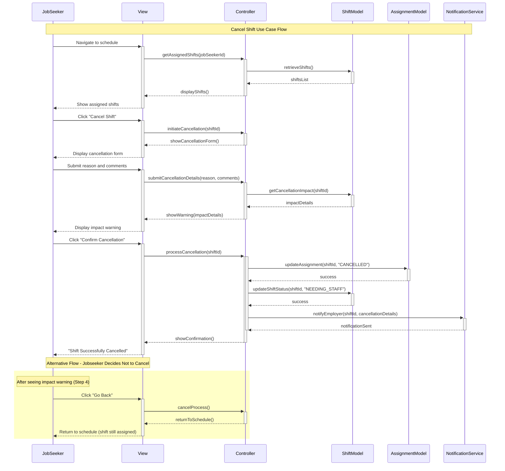

# Improved Cancel Shift Use Case

## Use Case Table: Cancel Shift

| Field | Description |
|-------|-------------|
| **ID** | UC5 |
| **Name** | Cancel Shift |
| **Description** | A Jobseeker cancels a previously confirmed and assigned shift, notifying the system and the employer manager. The system handles the cancellation process, updates shift status, impacts jobseeker rating, and triggers notifications. |
| **Actors** | Primary: Jobseeker Secondary: System, Employer Manager |
| **Triggers** | Jobseeker clicks the "Cancel Shift" button for an upcoming, assigned shift on their schedule |
| **Preconditions** | 1. Jobseeker is logged in and authenticated 2. Jobseeker has at least one confirmed shift assigned to them 3. Shift is scheduled for the future (not past or currently in progress) 4. System is operational and accessible |
| **Postconditions** | **Success:** - System removes jobseeker from shift assignment - Shift status is updated to "needing staff" - Jobseeker's reliability rating is reduced based on cancellation policy - Employer manager receives notification about the cancellation - Cancellation is logged in the system for audit purposes - Shift becomes available for reassignment to other qualified jobseekers |
| **Error States** | 1. **Network/System Error:** Connection lost during cancellation process 2. **Late Cancellation:** Attempting to cancel within restricted time frame 3. **Shift Already Started:** Attempting to cancel a shift that has already begun 4. **Invalid Shift State:** Shift is no longer assigned to the jobseeker 5. **Authentication Error:** Session expired during cancellation process |
| **Main Flow** | 1. **Select Shift:** Jobseeker navigates to their schedule/dashboard and selects the specific shift they want to cancel 2. **Initiate Cancellation:** Jobseeker clicks the "Cancel Shift" button for the selected shift 3. **Provide Reason:** System displays a cancellation form where jobseeker selects a reason from predefined options (illness, emergency, personal conflict, etc.) and optionally adds comments 4. **Review Impact:** System displays a warning message showing the impact of cancellation including: rating reduction, cancellation policy details, and potential consequences 5. **Confirm Cancellation:** Jobseeker reviews all information and clicks the "Confirm Cancellation" button to proceed 6. **Process and Notify:** System processes the cancellation, updates all relevant records, sends notifications to employer, and displays a "Shift Successfully Cancelled" confirmation message to the jobseeker |
| **Alternative Flows** | **Alt 1 - Jobseeker Decides Not to Cancel:** 4a. After seeing the impact warning, jobseeker clicks "Go Back" or "Keep Shift" button 5a. System returns jobseeker to their schedule view with the shift still assigned and no changes made  **Alt 2 - Late Cancellation Warning:** 3a. If cancellation is within restricted time frame, system shows additional warning about penalty 3b. Jobseeker can choose to proceed with penalty or cancel the action  **Alt 3 - Emergency Cancellation:** 3a. If jobseeker selects "Emergency" as reason, system may waive or reduce rating penalty 3b. System may require additional verification for emergency cancellations |
| **Business Rules** | 1. Cancellations made more than 24 hours before shift start have minimal rating impact 2. Cancellations made within 24 hours result in moderate rating reduction 3. Cancellations made within 4 hours result in significant rating impact 4. Emergency cancellations may be reviewed for penalty waiver 5. Repeated cancellations may result in temporary suspension from new assignments 6. System maintains cancellation history for performance tracking |
| **Non-Functional Requirements** | - Response time: Cancellation process should complete within 3 seconds - Availability: Feature should be available 24/7 - Notifications: Employer should receive notification within 1 minute - Data integrity: All cancellation data must be accurately recorded - User experience: Process should be intuitive and require minimal clicks |

## Key Improvements Made:

### 1. **Expanded Main Flow (6 Steps)**
- Added more detailed step-by-step process
- Included reason selection step
- Added impact review step
- Made confirmation more explicit

### 2. **Enhanced Error States**
- Added specific error scenarios
- Included system and business logic errors
- Made error handling more comprehensive

### 3. **Improved Alternative Flows**
- Added multiple alternative scenarios
- Included late cancellation handling
- Added emergency cancellation flow

### 4. **Added Business Rules**
- Defined cancellation timing policies
- Specified rating impact rules
- Added performance tracking requirements

### 5. **Added Non-Functional Requirements**
- Performance requirements
- Availability requirements
- User experience standards

### 6. **Enhanced Descriptions**
- More detailed postconditions
- Clearer actor definitions
- Better preconditions coverage

This improved use case provides a more comprehensive and professional specification that covers all aspects of the cancel shift functionality, making it suitable for development and testing teams.

## Sequence Diagram

## Diagram Components Explanation

### **Participants (Simplified):**
- **JobSeeker (JS)**: The primary actor initiating the cancellation
- **View (V)**: The user interface layer handling display and user interactions
- **Controller (C)**: The business logic layer orchestrating the cancellation process
- **ShiftModel (SM)**: Manages shift data and status updates
- **AssignmentModel (AM)**: Handles shift assignments and cancellation updates
- **NotificationService (NS)**: Handles employer notifications

### **Key Features:**
- **Streamlined Flow**: Reduced from 8 to 6 participants for better readability
- **Consolidated Actions**: Combined related operations to reduce visual complexity
- **Clear Main Path**: Shows the complete 6-step cancellation process
- **Single Alternative Flow**: Only includes the "Jobseeker Decides Not to Cancel" scenario
- **Activation Blocks**: Shows when components are actively processing

### **Design Simplifications:**
- **Removed**: JobSeekerModel and EmployerManager for cleaner diagram
- **Combined**: Rating updates and logging handled within existing components
- **Consolidated**: Multiple notification steps into single NotificationService call
- **Focused**: Single alternative flow instead of multiple complex scenarios
