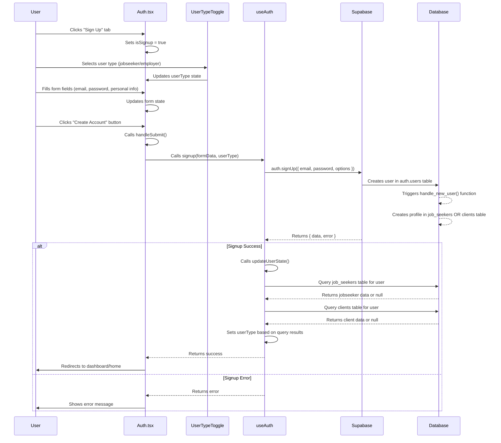
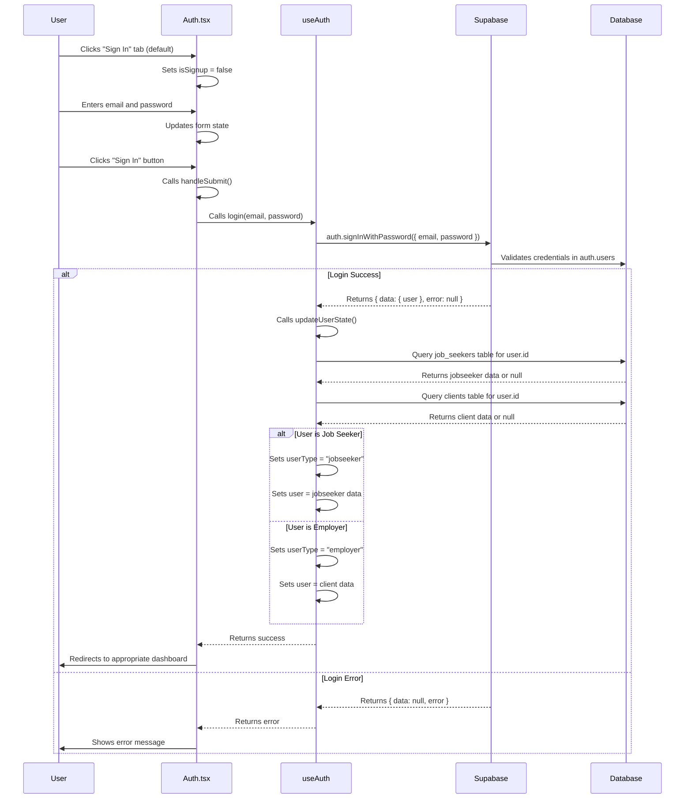

# Authentication Use Cases - Sequence Diagrams

This document contains Mermaid sequence diagrams for the OptiStaff authentication system, focusing on components that directly interact with hooks.

## Use Case 1: Create Account (Sign Up)

## Use Case 2: Sign In (Login)

## Component-Hook Interaction Summary

### Hook-Calling Components:
- **Auth.tsx**: Main authentication page that directly calls `useAuth` hook methods
  - Calls `signup()` for account creation
  - Calls `login()` for sign in
  - Manages form state and user interaction

### Pure UI Components (No Direct Hook Calls):
- **AuthFormFields.tsx**: Renders form fields based on props
- **UserTypeToggle.tsx**: Toggle component for user type selection
- **AuthHeader.tsx**: Header component for authentication pages
- **AuthFooter.tsx**: Footer component for authentication pages
- **FormField.tsx**: Reusable form field component

### Key Database Operations:
1. **Account Creation**: 
   - `auth.signUp()` creates user in `auth.users`
   - `handle_new_user()` trigger creates profile in `job_seekers` or `clients`
   - `create_default_preferences()` function sets up user preferences

2. **Sign In**:
   - `auth.signInWithPassword()` validates credentials
   - `updateUserState()` queries both `job_seekers` and `clients` tables
   - Sets appropriate user type and profile data

### Hook State Management:
- **useAuth** manages:
  - `user`: Current user profile data
  - `userType`: "jobseeker" | "employer" | null
  - `loading`: Authentication operation status
  - `updateUserState()`: Determines user type from database queries
