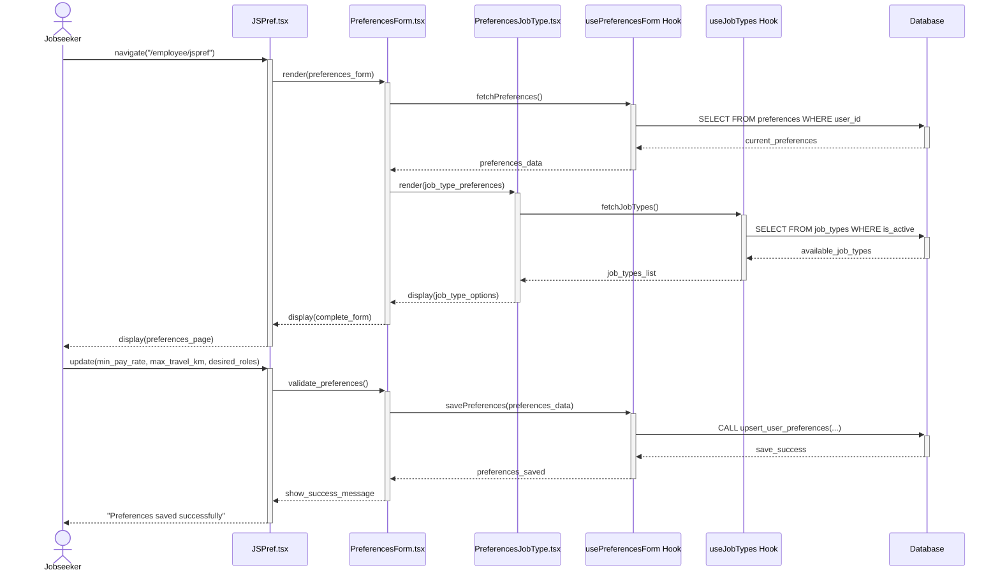
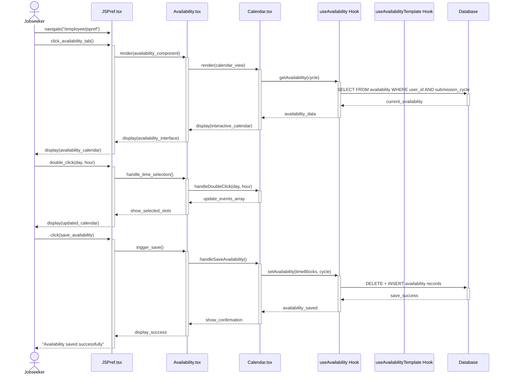

### Use Case 1: Create Account

| Field                | Description                                                                                                                                                             |
| -------------------- | ----------------------------------------------------------------------------------------------------------------------------------------------------------------------- |
| **ID**               | UC1                                                                                                                                                                     |
| **Name**             | Create Account                                                                                                                                                          |
| **Description**      | A new user registers for either a Jobseeker or employer account on the platform.                                                                                        |
| **Actors**           | Unauthenticated Jobseeker or Employer                                                                                                                                   |
| **Triggers**         | “Don't have an account? Sign up” button on sign-in page clicked                                                                                                         |
| **Precondition**     | The user does not have a pre-existing account with the submitted email.                                                                                                 |
| **Postcondition**    | New account created and saved to database; verification email sent; can now sign in                                                                                     |
| **Error States**     | Email address is already registered                                                                                                                                     |
| **Flow**             | 1. User enters email 2. User enters and confirms password 3. User chooses Jobseeker 4. Jobseeker enters personal details 5. System sends verification email |
| **Alternative Flow** | 1–2. Same 3. User chooses Employer 4. Employer enters company details 5. System sends verification email                                                       |

---

### Use Case 2: Sign In

| Field                | Description                                                                                                     |
| -------------------- | --------------------------------------------------------------------------------------------------------------- |
| **ID**               | UC2                                                                                                             |
| **Name**             | Sign In                                                                                                         |
| **Description**      | User signs into platform                                                                                        |
| **Actors**           | Jobseeker, Employer                                                                                             |
| **Triggers**         | “Sign In” button on landing page clicked                                                                        |
| **Precondition**     | Email and Password registered; user not logged in                                                               |
| **Postcondition**    | User enters platform and sees dashboard                                                                         |
| **Error States**     | Invalid credentials; login with unverified email                                                                |
| **Flow**             | 1. Enter email 2. Enter password 3. Click “Sign in” 4. System validates credentials                    |
| **Alternative Flow** | Invalid email: system shows “create account” Invalid password: shows “reset password” and sends instructions |

---

### Use Case 3: Set Preferences

| Field                | Description                                                                                                                                             |
| -------------------- | ------------------------------------------------------------------------------------------------------------------------------------------------------- |
| **ID**               | UC3                                                                                                                                                     |
| **Name**             | Set Preferences                                                                                                                                         |
| **Description**      | Jobseeker sets preferences to be eligible for shifts                                                                                                    |
| **Actors**           | Jobseeker                                                                                                                                               |
| **Triggers**         | Navigates to "Preferences" section of profile                                                                                                           |
| **Preconditions**    | Jobseeker is logged in and authenticated                                                                                                                |
| **Postconditions**   | Preferences saved in database linked to user                                                                                                            |
| **Error States**     | Nil                                                                                                                                                     |
| **Flow**             | 1. Enter preferences (pay, distance, shift cap, job type) 2. System displays matching jobs 3. Click "Save Preferences" 4. System confirms save |
| **Alternative Flow** | Nil                                                                                                                                                     |

---

### Use Case 4: Indicate Availability

| Field                | Description                                                                                                                                |
| -------------------- | ------------------------------------------------------------------------------------------------------------------------------------------ |
| **ID**               | UC4                                                                                                                                        |
| **Name**             | Indicate Availability                                                                                                                      |
| **Description**      | Jobseeker specifies available days and times                                                                                               |
| **Actors**           | Jobseeker                                                                                                                                  |
| **Triggers**         | Navigates to "Availability" tab                                                                                                            |
| **Preconditions**    | Jobseeker is logged in and authenticated                                                                                                   |
| **Postconditions**   | Availability records saved in database                                                                                                     |
| **Error States**     | Nil                                                                                                                                        |
| **Flow**             | 1. Toggle to week 2. Select time slots 3. System validates and creates records 4. Confirm availability 5. System confirms save |
| **Alternative Flow** | N/A                                                                                                                                        |

---

### Use Case 5: Cancel Shift

| Field                | Description                                                                                                                      |
| -------------------- | -------------------------------------------------------------------------------------------------------------------------------- |
| **ID**               | UC5                                                                                                                              |
| **Name**             | Cancel Shift                                                                                                                     |
| **Description**      | Jobseeker cancels an assigned shift                                                                                              |
| **Actors**           | Jobseeker                                                                                                                        |
| **Triggers**         | Clicks "Cancel Shift" button for an upcoming shift                                                                               |
| **Preconditions**    | Logged in; at least one assigned shift                                                                                           |
| **Postconditions**   | Removed from shift; rating reduced; shift flagged                                                                                |
| **Error States**     | Nil                                                                                                                              |
| **Flow**             | 1. Select shift 2. Click cancel and choose reason 3. Warning about rating 4. Confirm 5. System confirms cancellation |
| **Alternative Flow** | 4a. Click “go back” 5a. Returned to schedule view                                                                             |

---

### Use Case 6: List Jobs

| Field                | Description                                                                                                                                             |
| -------------------- | ------------------------------------------------------------------------------------------------------------------------------------------------------- |
| **ID**               | UC6                                                                                                                                                     |
| **Name**             | List Jobs                                                                                                                                               |
| **Description**      | Employer defines shift requirements                                                                                                                     |
| **Actors**           | Employer                                                                                                                                                |
| **Triggers**         | Navigates to "Post a Job" or "Upload Shifts"                                                                                                            |
| **Preconditions**    | Employer is logged in and authenticated                                                                                                                 |
| **Postconditions**   | Shifts created and set to 'OPEN'; included in scheduling                                                                                                |
| **Error States**     | Invalid data; CSV errors prevent import                                                                                                                 |
| **Flow**             | 1. Click "Post a New Job" 2. Fill job form 3. Submit 4. System validates 5. Shift records created 6. Confirmation message                |
| **Alternative Flow** | Upload via CSV: 1a. Select "Upload CSV" 2a. Upload file 3a. Parse and validate 4a. Create valid records 5a. Show confirmation and errors |

---

### Use Case 7: Review Employee

| Field                | Description                                                                                              |
| -------------------- | -------------------------------------------------------------------------------------------------------- |
| **ID**               | UC7                                                                                                      |
| **Name**             | Review Employee                                                                                          |
| **Description**      | Employer reviews an employee                                                                             |
| **Actors**           | Employer                                                                                                 |
| **Triggers**         | Clicks “Rate Employee”                                                                                   |
| **Preconditions**    | Logged in; employee has completed job                                                                    |
| **Postcondition**    | Review and rating saved                                                                                  |
| **Flow**             | 1. Go to completed shift 2. Select rating 3. Click submit 4. Rating updated, confirmation shown |
| **Alternative Flow** | NA                                                                                                       |

---

### Use Case 8: Employer Cancels Job Listing

| Field                | Description                                                                                                                                         |
| -------------------- | --------------------------------------------------------------------------------------------------------------------------------------------------- |
| **ID**               | UC8                                                                                                                                                 |
| **Name**             | Employer Cancels Job Listing                                                                                                                        |
| **Description**      | Employer cancels a posted shift/job request                                                                                                         |
| **Actors**           | Employer                                                                                                                                            |
| **Triggers**         | Clicks "Cancel" on job listing                                                                                                                      |
| **Preconditions**    | Shift removed from allocation; if assigned, notify employee                                                                                         |
| **Postcondition**    | Shift status updated to 'CANCELLED'                                                                                                                 |
| **Flow**             | 1. View posted shifts 2. Locate shift 3. Click "Cancel" 4. Confirm prompt 5. Status set to 'CANCELLED' 6. Confirmation message shown |
| **Alternative Flow** | If shift is assigned, system notifies employee                                                                                                      |

---

## Updated Sequence Diagrams (Corrected Implementation)

### Use Case 3: Set Preferences (Corrected)

### Components Involved:
- **UI**: `src/pages/employee/JSPref.tsx`
- **Components**: `src/components/PreferencesForm.tsx`, `src/components/PreferencesJobType.tsx`
- **Hook**: `src/hooks/usePreferencesForm.tsx`, `src/hooks/useJobTypes.tsx`
- **Database**: `preferences` table, `job_types` table

### Sequence Diagram:

### Use Case 4: Indicate Availability (Corrected)

### Components Involved:
- **UI**: `src/pages/employee/JSPref.tsx`
- **Components**: `src/components/Availability.tsx`, `src/components/Calendar.tsx`
- **Hook**: `src/hooks/useAvailability.tsx`, `src/hooks/useAvailabilityTemplate.tsx`
- **Database**: `availability` table, `availability_templates` table

### Sequence Diagram:

