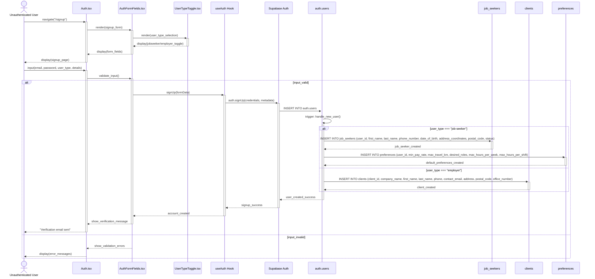
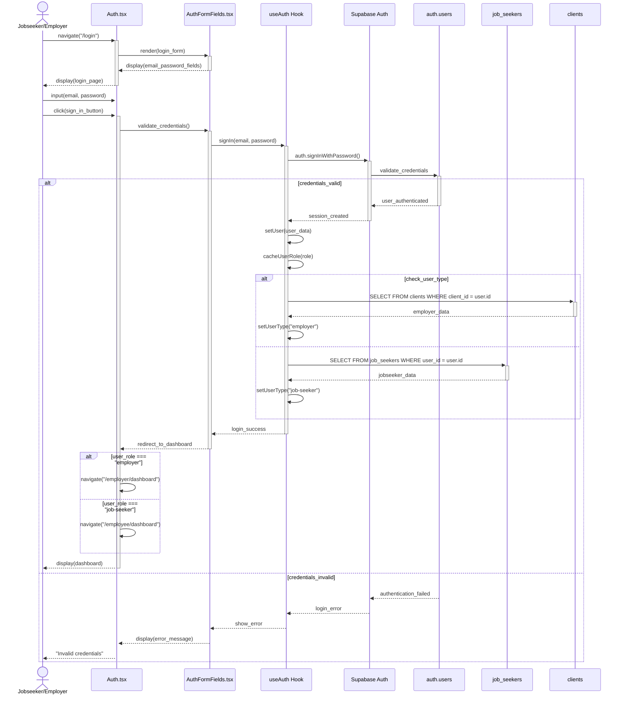
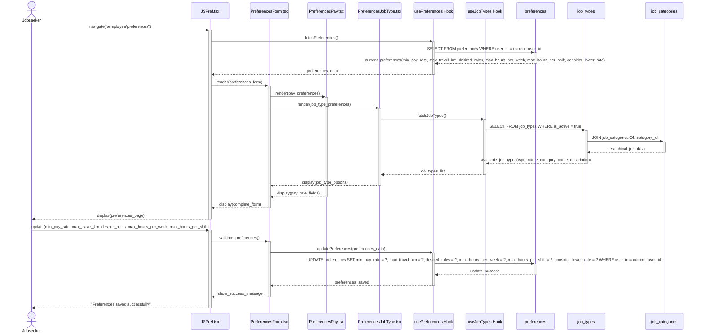
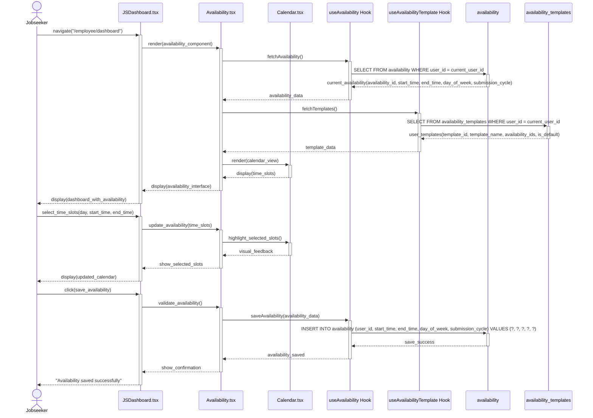
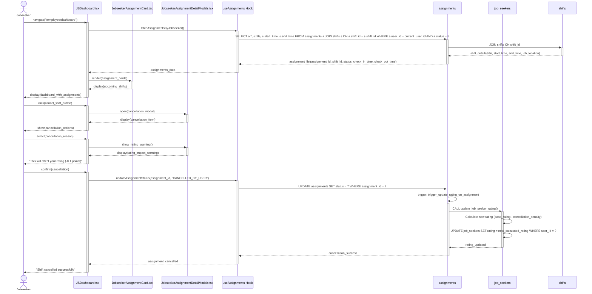
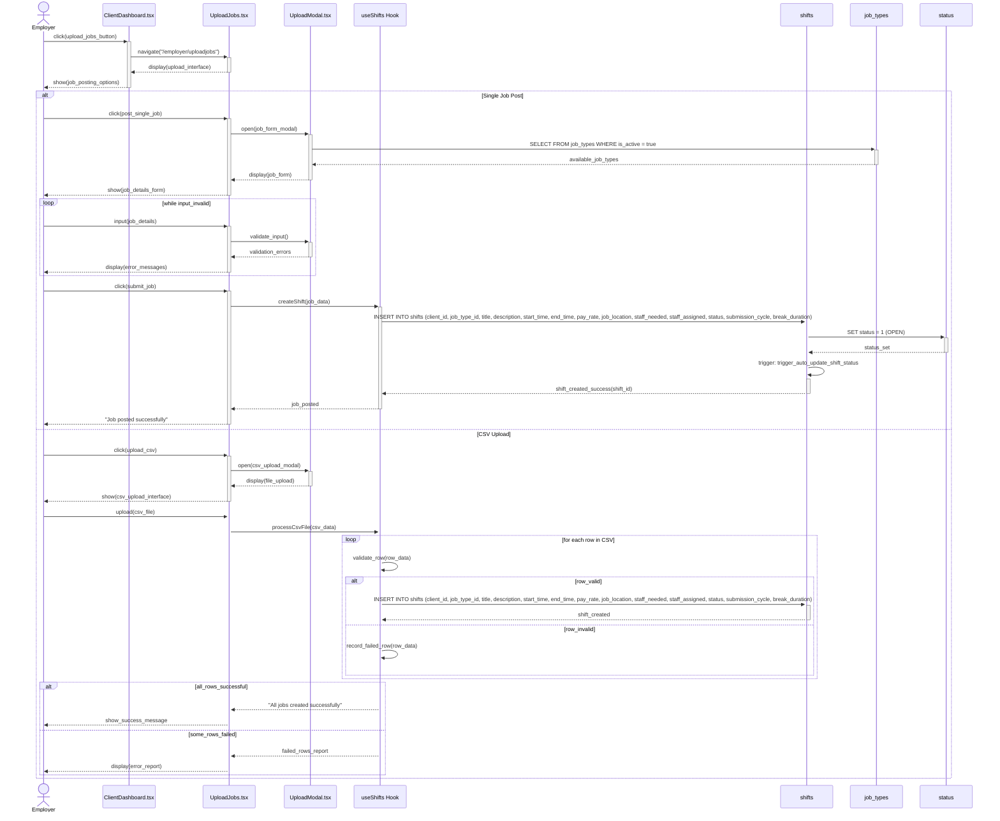
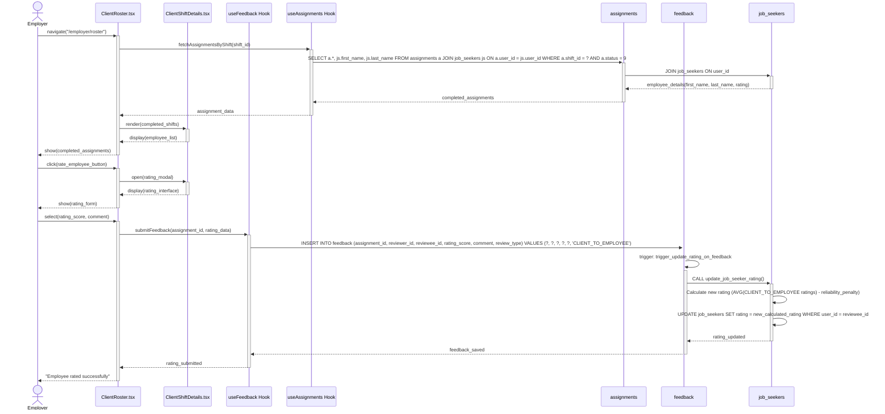
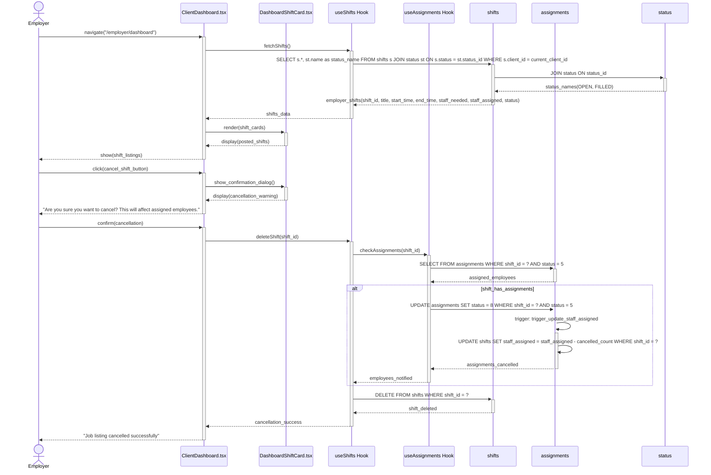

# Sequence Diagram Instructions for Use Cases

This document provides instructions for creating Mermaid sequence diagrams for each use case in `use_case_tables.md`, mapping to actual components, hooks, and database tables from the OptiStaff codebase.

## General Format Guidelines

- **Actor**: The user type (Jobseeker, Employer, Unauthenticated User)
- **UI**: Specific page or component from `src/pages/` or `src/components/`
- **Hook**: Custom hook from `src/hooks/` that handles the business logic
- **Database Tables**: Specific tables from backend-overview.md (auth.users, job_seekers, clients, shifts, assignments, feedback, preferences, availability, etc.)
- **Database Functions**: Specific functions and triggers (handle_new_user(), update_job_seeker_rating(), etc.)

## Use Case 1: Create Account

### Components Involved:
- **UI**: `src/pages/Auth.tsx` or `src/pages/Signup.tsx`
- **Components**: `src/components/auth/AuthFormFields.tsx`, `src/components/auth/UserTypeToggle.tsx`
- **Hook**: `src/hooks/useAuth.tsx`
- **Database Tables**: `auth.users`, `job_seekers`, `clients`, `preferences`
- **Database Functions**: `handle_new_user()` trigger

### Sequence Diagram:

## Use Case 2: Sign In

### Components Involved:
- **UI**: `src/pages/Auth.tsx` or `src/pages/Login.tsx`
- **Components**: `src/components/auth/AuthFormFields.tsx`
- **Hook**: `src/hooks/useAuth.tsx`
- **Database Tables**: `auth.users`, `job_seekers`, `clients`

### Sequence Diagram:

## Use Case 3: Set Preferences

### Components Involved:
- **UI**: `src/pages/employee/JSPref.tsx` or `src/pages/jobseeker/Preferences.tsx`
- **Components**: `src/components/PreferencesForm.tsx`, `src/components/PreferencesPay.tsx`, `src/components/PreferencesJobType.tsx`, `src/components/PreferencesMaximum.tsx`
- **Hook**: `src/hooks/usePreferences.tsx`, `src/hooks/useJobTypes.tsx`
- **Database Tables**: `preferences`, `job_types`, `job_categories`

### Sequence Diagram:

## Use Case 4: Indicate Availability

### Components Involved:
- **UI**: `src/pages/employee/JSDashboard.tsx`
- **Components**: `src/components/Availability.tsx`, `src/components/Calendar.tsx`, `src/components/MonthlyCalendar.tsx`
- **Hook**: `src/hooks/useAvailability.tsx`, `src/hooks/useAvailabilityTemplate.tsx`
- **Database Tables**: `availability`, `availability_templates`

### Sequence Diagram:

## Use Case 5: Cancel Shift

### Components Involved:
- **UI**: `src/pages/employee/JSDashboard.tsx`
- **Components**: `src/components/JobseekerAssignmentCard.tsx`, `src/components/JobseekerAssignmentDetailModals.tsx`
- **Hook**: `src/hooks/useAssignments.tsx`
- **Database Tables**: `assignments`, `job_seekers`, `shifts`
- **Database Functions**: `update_assignment_status()`, `update_job_seeker_rating()` trigger

### Sequence Diagram:

## Use Case 6: List Jobs

### Components Involved:
- **UI**: `src/pages/employer/UploadJobs.tsx`, `src/pages/employer/ClientDashboard.tsx`
- **Components**: `src/components/UploadModal.tsx`, `src/components/CustomInputField.tsx`, `src/components/UploadCSV.tsx`
- **Hook**: `src/hooks/useShifts.tsx`
- **Database Tables**: `shifts`, `job_types`, `status`
- **Database Functions**: `create_shift()`, `auto_update_shift_status()` trigger

### Sequence Diagram:

## Use Case 7: Review Employee

### Components Involved:
- **UI**: `src/pages/employer/ClientRoster.tsx` or `src/pages/employer/ClientEdit.tsx`
- **Components**: `src/components/ClientShiftDetails.tsx`, Rating component (to be implemented)
- **Hook**: `src/hooks/useFeedback.tsx`, `src/hooks/useAssignments.tsx`
- **Database Tables**: `feedback`, `assignments`, `job_seekers`
- **Database Functions**: `update_job_seeker_rating()` trigger

### Sequence Diagram:

## Use Case 8: Employer Cancels Job Listing

### Components Involved:
- **UI**: `src/pages/employer/ClientDashboard.tsx`, `src/pages/employer/ClientEdit.tsx`
- **Components**: `src/components/DashboardShiftCard.tsx`, Confirmation dialog
- **Hook**: `src/hooks/useShifts.tsx`, `src/hooks/useAssignments.tsx`
- **Database Tables**: `shifts`, `assignments`, `status`
- **Database Functions**: `update_staff_assigned()` trigger

### Sequence Diagram:

## Implementation Notes

1. **Database Table Integration**: Each sequence diagram now references the specific database tables from `backend-overview.md` including:
   - **User Management**: `auth.users`, `job_seekers`, `clients`
   - **Scheduling**: `shifts`, `availability`, `availability_templates`
   - **Work Management**: `assignments`, `feedback`
   - **Classification**: `job_types`, `job_categories`, `status`
   - **Preferences**: `preferences`
   - **Financial**: `payouts`

2. **Database Functions**: References actual database functions and triggers:
   - `handle_new_user()` - Auto-creates profiles on registration
   - `update_job_seeker_rating()` - Updates ratings based on feedback and reliability
   - `update_staff_assigned()` - Maintains shift capacity counters
   - `auto_update_shift_status()` - Manages shift open/filled status
   - `create_shift()` - Safe shift creation with validation

3. **Status System**: Uses the integer-based status system:
   - **Shift Status**: 1 = OPEN, 2 = FILLED
   - **Assignment Status**: 5 = CONFIRMED, 7 = CANCELLED_BY_USER, 8 = NO_SHOW, 9 = COMPLETED

4. **Relationships**: Shows proper table relationships and foreign key constraints as defined in the backend schema.

5. **Triggers**: Includes automatic database triggers that execute business logic (rating updates, capacity management, status transitions).

6. **RLS Policies**: Considers Row Level Security policies that ensure users only access authorized data.

## Usage Instructions

1. Copy the relevant sequence diagram code for each use case
2. Customize the participant names to match your specific implementation
3. Add error handling flows as needed based on database constraints
4. Include loading states and user feedback messages
5. Ensure all database operations match the actual table schema and functions
6. Consider RLS policies when showing data access patterns
7. Include trigger effects in the sequence flow where applicable