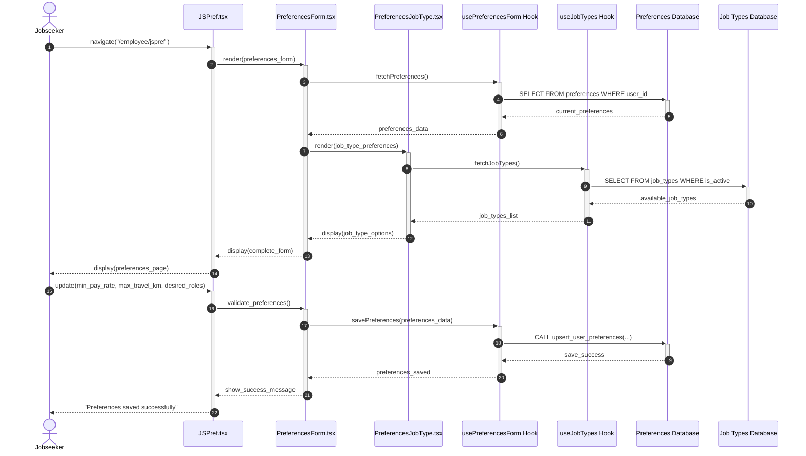

### Use Case 3: Set Preferences (With Separate Databases)

### Components Involved:
- **UI**: `src/pages/employee/JSPref.tsx`
- **Components**: `src/components/PreferencesForm.tsx`, `src/components/PreferencesJobType.tsx`
- **Hook**: `src/hooks/usePreferencesForm.tsx`, `src/hooks/useJobTypes.tsx`
- **Database**: `preferences_db`, `job_types_db`

### Sequence Diagram:

