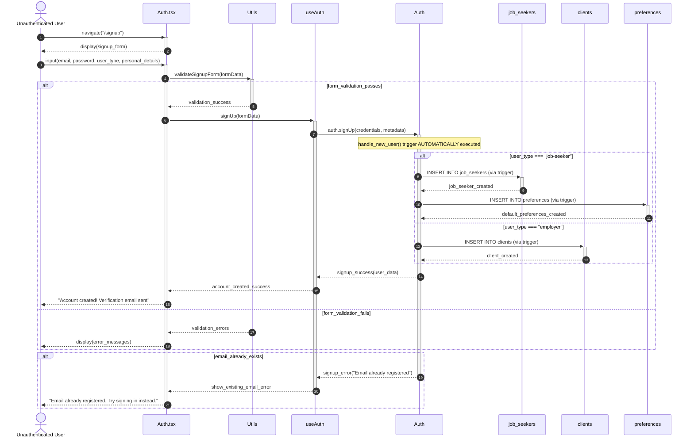

# Use Case 1: Create Account - Refactored Sequence Diagram

## Use Case Overview

- **ID**: UC1
- **Name**: Create Account
- **Description**: A new user registers for either a Jobseeker or employer account on the platform
- **Actors**: Unauthenticated User
- **Triggers**: "Don't have an account? Sign up" button on sign-in page clicked

## Refactored Sequence Diagram

## Key Components and Their Roles

### View Layer (Auth.tsx)

- Handles user interface for signup form
- Manages form state and user interactions
- Displays success/error messages
- Routes user input to validation and authentication

### Utils Layer

- **validateSignupForm()**: Validates email format, password strength, required fields
- Handles client-side validation before API calls

### Controller Layer (useAuth)

- **signUp()**: Orchestrates the account creation process
- Manages authentication state
- Handles Supabase auth integration
- Processes success/error responses

### Model Layer (Database Tables)

- **auth.users**: Core authentication table with user credentials
- **job_seekers**: Profile data for job seeker accounts
- **clients**: Profile data for employer accounts
- **preferences**: Default preferences for job seekers

## Database Triggers and Functions

- **handle_new_user()**: Database trigger that automatically executes when a new user is inserted into `auth.users` table via `supabase.auth.signUp()`
- Automatically creates appropriate profile records based on user_type metadata
- Ensures data consistency across related tables
- Sets up default preferences for job seekers
- **Trigger Timing**: Executes immediately after `auth.users` INSERT, before `auth.signUp()` returns response

## Use Case Compliance Verification

✅ **Email and Password Entry**: Handled in View layer with Utils validation
✅ **User Type Selection**: Processed in Controller and routed to appropriate Model tables
✅ **Personal/Company Details**: Stored in job_seekers or clients tables respectively
✅ **Verification Email**: Sent automatically by Supabase auth.signUp()
✅ **Error Handling**: Email already exists scenario handled with appropriate user feedback
✅ **Account Creation**: Complete profile creation with related data (preferences for job seekers)

## Data Flow Summary

1. User submits signup form through Auth.tsx
2. Utils validates form data client-side
3. useAuth hook processes signup with Supabase
4. Database trigger creates appropriate profile records
5. Success/error feedback provided to user
6. New account ready for sign-in upon email verification
