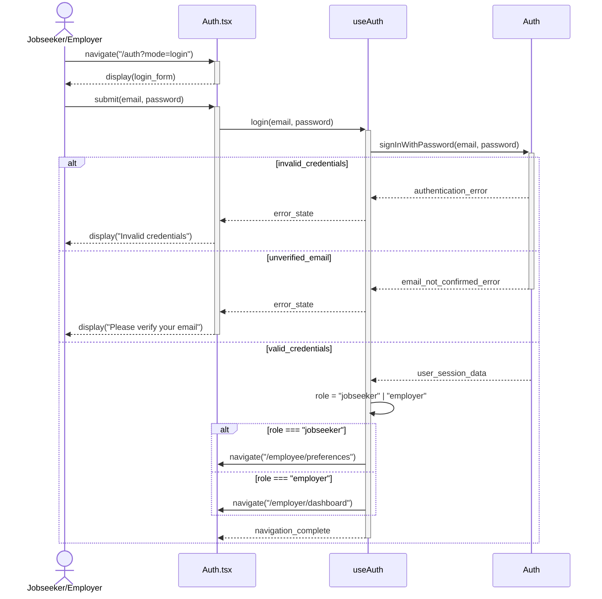
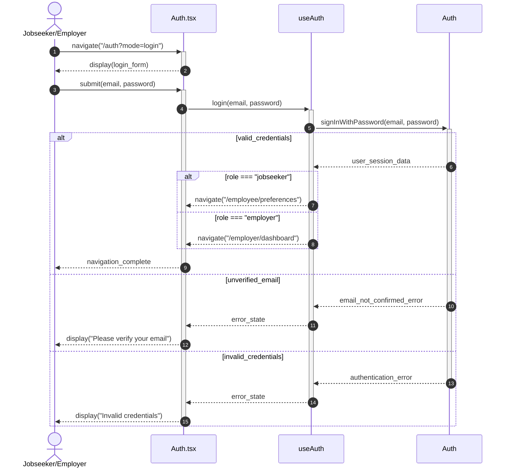

# Use Case 2: Sign In - Refactored Sequence Diagram

## Use Case Overview

**ID**: UC2  
**Name**: Sign In  
**Description**: User signs into platform  
**Actors**: Jobseeker, Employer  
**Triggers**: "Sign In" button on landing page clicked  
**Precondition**: Email and Password registered; user not logged in  
**Postcondition**: User enters platform and sees dashboard  
**Error States**: Invalid credentials; login with unverified email

## Sequence Diagram

## Key Components and Responsibilities

### Actor

- **User**: Jobseeker or Employer attempting to sign in

### View Layer

- **Auth.tsx**: Authentication page component
  - Renders login form
  - Handles form submission
  - Displays success/error messages
  - Manages navigation based on auth state

### Controller Layer

- **useAuth**: Authentication business logic hook
  - `login()`: Core login function
  - `updateUserState()`: Role determination and state management
  - Authentication state management (user, loading, error)
  - Navigation logic based on user role

### External Services

- **Supabase Auth**: Authentication service
  - `signInWithPassword()`: Credential validation
  - Returns user session data or error

### Storage

- **localStorage**: Role caching for performance

## Business Rules Implemented

1. **Authentication**: Credential validation via Supabase Auth
2. **Role Determination**: Extract user role from `user.user_metadata.user_type` (set during registration)
3. **Navigation Logic**: Role-based dashboard redirection after successful login
4. **Error Handling**: Distinct error states for invalid credentials and unverified emails

## Error States Handled

1. **Invalid Credentials**: Wrong email/password combination
2. **Unverified Email**: Account exists but email not confirmed
3. **Validation Errors**: Client-side input validation failures
4. **Network Errors**: Supabase connection issues

## Navigation Flow

- **Jobseeker**: `/auth?mode=login` → `/employee/preferences`
- **Employer**: `/auth?mode=login` → `/employer/dashboard`
- **Error Cases**: Remain on login page with error display

